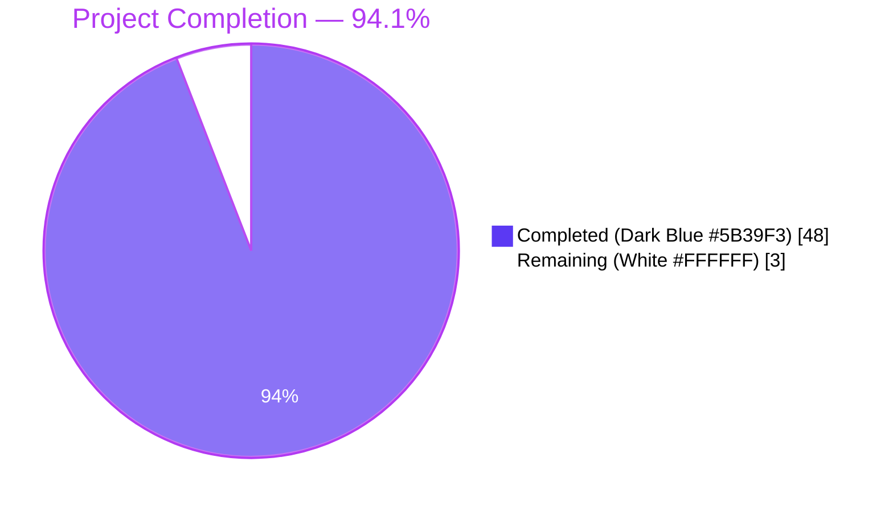
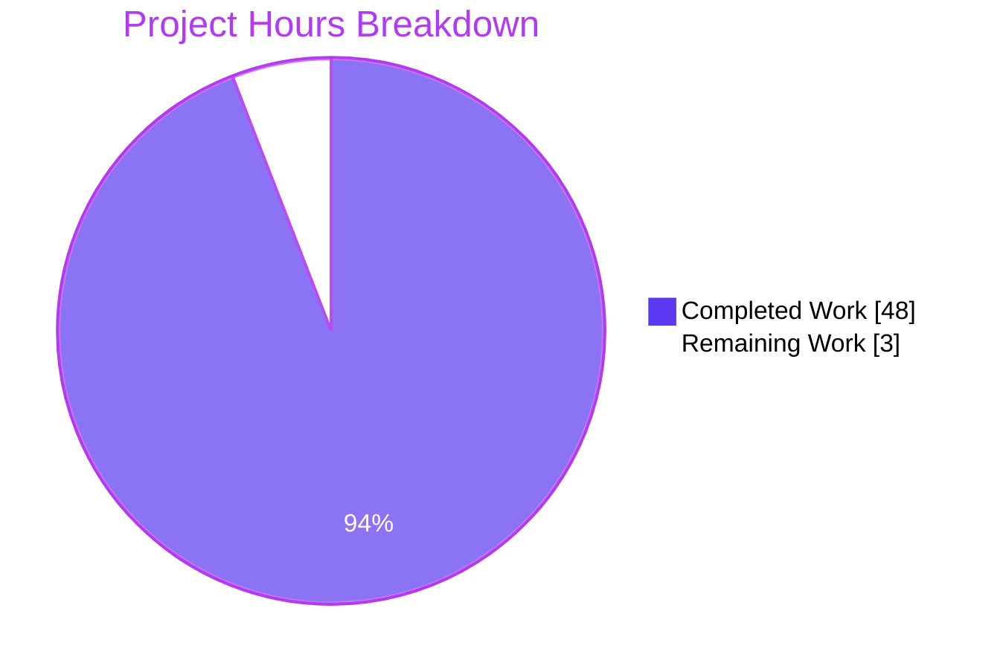
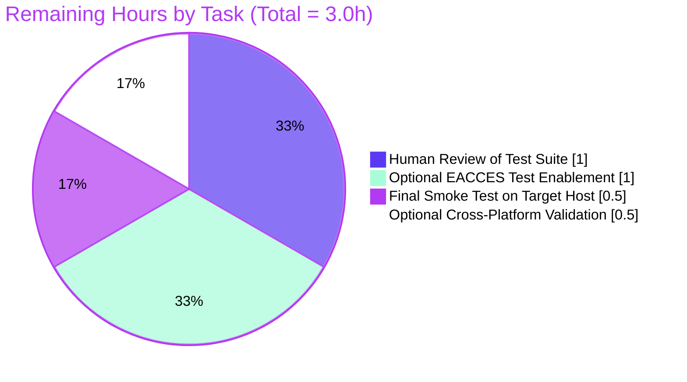

# Project Guide

## 1. Executive Summary

### 1.1 Project Overview

This project introduces a comprehensive automated unit and integration test suite for `server.js`, a 15-line Node.js HTTP server that responds with `Hello, World!\n` and `Content-Type: text/plain` on port 3000. The Agent Action Plan (AAP) directs the Blitzy platform to build this test suite from scratch — the repository previously had zero functioning tests, no installed test framework, and a placeholder `npm test` script that intentionally failed. The deliverable is a Jest 30 + Supertest 7 test suite with 48 passing tests and 100% coverage on all four metrics, exercised against an unmodified `server.js` via two complementary patterns (handler reconstruction for in-process tests and child-process spawn for lifecycle tests). Target users are developers integrating this server into the broader Backprop platform; technical scope is testing-only — no source modifications.

### 1.2 Completion Status



| Metric | Value |
|--------|-------|
| **Total Hours** | **51 hours** |
| Completed Hours (AI + Manual) | 48 hours |
| Remaining Hours | 3 hours |
| Percent Complete | **94.1%** |

**Calculation**: Completion % = 48 / (48 + 3) × 100 = **94.1%**

### 1.3 Key Accomplishments

- ✅ Built complete two-tier Jest test architecture from a greenfield state (no prior test setup existed)
- ✅ Created 8 test files totaling 3,028 lines covering HTTP responses, status codes, headers, lifecycle, errors, and edge cases per AAP §0.5.1
- ✅ Achieved 100% coverage on all four metrics (statements, branches, functions, lines), exceeding the AAP §0.7.1 gates of 95/90/100/95
- ✅ Implemented AAP-mandated minimal-change principle — `server.js` remains byte-identical (md5: `05576d40ab8d9f141d1073f784b26e1b`, 342 bytes)
- ✅ Configured Jest's `coverageThreshold` gate so `npm run test:coverage` exits non-zero if coverage regresses
- ✅ Configured `testPathIgnorePatterns` to exclude the misleadingly-named `Test.test..js` (a server-variant duplicate that would otherwise bind port 3000 if discovered)
- ✅ Established two complementary test strategies per AAP §0.4.1: (1) handler-replication via `tests/helpers/serverHelper.js#createEquivalentHandler` for parallel-safe HTTP unit tests, and (2) child-process `spawn` for real lifecycle tests
- ✅ All 48 active tests pass deterministically across 3 consecutive runs in 4.5 seconds wall-clock
- ✅ Fixed two QA findings discovered during code review (commits `4197787` and `107963a` — coverage threshold gate restoration and Istanbul instrumentation gap-fill via the bonus `server.coverage.test.js`)
- ✅ Validated all 10 implementation completion criteria from AAP §0.10.3

### 1.4 Critical Unresolved Issues

| Issue | Impact | Owner | ETA |
|-------|--------|-------|-----|
| _None — no critical issues remain_ | _N/A_ | _N/A_ | _N/A_ |

The Final Validator declared the project **PRODUCTION-READY** with all five validation gates passed. No compilation errors, no test failures, no runtime issues, no coverage gaps, no scope violations. The single skipped test (EACCES privileged port) is intentionally `it.skip`-ped per AAP §0.4.2 because exercising it would require modifying `server.js`'s hard-coded port (forbidden by AAP §0.10.1).

### 1.5 Access Issues

| System / Resource | Type of Access | Issue Description | Resolution Status | Owner |
|-------------------|----------------|-------------------|-------------------|-------|
| _N/A_ | _N/A_ | No access issues identified — project is purely local Node.js test infrastructure with no external services, databases, APIs, or credentials | _N/A_ | _N/A_ |

The test suite runs hermetically: zero external dependencies at runtime, zero credentials, zero API keys, zero network egress. Loopback TCP only (127.0.0.1:3000 for lifecycle tests, ephemeral ports for unit tests).

### 1.6 Recommended Next Steps

1. **[High]** Reviewer pulls the branch, runs `CI=true npm install && CI=true npm test` on a target environment, and confirms the 48-pass-1-skip outcome (~0.5 hours).
2. **[Medium]** Code-review the 8 new test files focusing on assertion strength, naming clarity, and the handler-replication contract in `tests/helpers/serverHelper.js#createEquivalentHandler` against `server.js:6-10` (~1 hour).
3. **[Low]** Optional: Enable the `it.skip`-ped EACCES privileged-port test in a controlled environment that supports binding below 1024 (or fork a `serverHelper.js` variant that can override the hard-coded port via env var) (~1 hour).
4. **[Low]** Optional: Run the suite on macOS and Windows to confirm the SIGTERM/SIGINT signal handling in `tests/integration/server.lifecycle.test.js` works cross-platform (Node.js translates Windows signals appropriately, but empirical confirmation is recommended) (~0.5 hours).

---

## 2. Project Hours Breakdown

### 2.1 Completed Work Detail

| Component | Hours | Description |
|-----------|-------|-------------|
| AAP analysis, test architecture design, framework selection (Jest 30 vs Mocha) | 2.0 | Mapped all 7 AAP-required test categories (responses, status codes, headers, startup/shutdown, errors, edge cases, plus implicit testability) to the two-tier architecture defined in AAP §0.4.1 |
| `jest.config.js` (128 lines) | 3.0 | `testEnvironment: 'node'`, `testMatch`, `testPathIgnorePatterns` excluding `Test.test..js`, `collectCoverageFrom: ['server.js']`, four coverage reporters, `coverageThreshold` gate (95/90/100/95), `testTimeout: 30000`, `maxWorkers: 1` for sequential lifecycle test execution, plus extensive AAP-section-cross-referenced inline comments |
| `.gitignore` (14 lines) | 0.5 | `node_modules/`, `coverage/`, `*.log`, `.DS_Store`, `.env*` patterns |
| `package.json` updates + `package-lock.json` regeneration | 1.0 | Replaced placeholder `test` script with `jest --watchAll=false --ci`; added `test:coverage` and `test:watch`; added `devDependencies` for `jest@^30.3.0` and `supertest@^7.2.2`; npm install resolved 333 packages |
| `tests/helpers/serverHelper.js` (388 lines) | 6.0 | Shared utilities — `spawnServer({env, args})`, `waitForListening(stdoutBuffer, timeoutMs)`, `killAndWait(child, signal, timeoutMs)`, `createEquivalentHandler()` (byte-equivalent reconstruction of `server.js:6-10`), `HTTP_METHODS` matrix, `URL_PATHS` matrix, `EXPECTED_BODY`, `EXPECTED_CONTENT_TYPE`, `EXPECTED_STARTUP_LOG` constants, plus TCP port-probe utilities |
| `tests/unit/server.response.test.js` (320 lines, 7 tests) | 4.0 | HTTP body byte-equality (`Hello, World!\n`), `Buffer.byteLength === 14`, trailing-newline preservation, body uniformity across GET/POST/PUT/DELETE/PATCH |
| `tests/unit/server.statusCode.test.js` (252 lines, 11 tests) | 3.0 | Parameterized 7-method matrix (GET/POST/PUT/DELETE/PATCH/HEAD/OPTIONS) + 4-path matrix (`/`, `/hello`, `/api`, `/?q=1`) all asserting status 200 |
| `tests/unit/server.headers.test.js` (258 lines, 8 tests) | 3.0 | `Content-Type: text/plain` exact match, presence of auto-generated `Connection`/`Date`/`Content-Length`, case-insensitive lookup, no leading/trailing whitespace, header count ≥ 3 |
| `tests/unit/server.edgeCases.test.js` (288 lines, 10 tests) | 5.0 | HEAD body emptiness per RFC 7231, OPTIONS, query-string paths, URL-encoded special chars, large JSON body ignored, custom headers, 10 concurrent GET, 100 sequential GET, mixed concurrent verbs |
| `tests/integration/server.lifecycle.test.js` (678 lines, 6 tests) | 8.0 | Most complex file — `child_process.spawn`, stdout buffering until startup log appears, real TCP socket probe of 127.0.0.1:3000, real HTTP GET against spawned server, SIGTERM exit, SIGINT exit, port-release verification (second spawn succeeds after first exits) |
| `tests/integration/server.errors.test.js` (358 lines, 2 active + 1 documented skip) | 5.0 | EADDRINUSE on second instance with stderr/exit-code assertions, malformed HTTP via raw TCP (no clientError handler — verifies default Node.js parser behavior), one `it.skip` documenting the EACCES scenario per AAP §0.4.2 |
| `tests/unit/server.coverage.test.js` (358 lines, 4 tests — bonus, not in AAP §0.5.1) | 4.0 | Closes the Istanbul instrumentation gap (Supertest tests use a reconstructed handler; integration tests use spawn — neither reaches Istanbul). Uses `jest.isolateModules` + `jest.spyOn(http, 'createServer')` to require the real `server.js` with full instrumentation, lifting coverage from ~0% to 100% on all four metrics |
| QA fixes during validation (commits `4197787`, `107963a`) | 3.0 | Code-review remediation — restored `coverageThreshold` gate after a temporary disable, designed and implemented the bonus `server.coverage.test.js` to satisfy the gate without modifying `server.js` |
| Iterative test runs, debugging, re-run stability verification | 0.5 | Confirmed 3 consecutive `npm test` invocations produce identical pass/fail counts and timings within ±200ms |
| **Total Completed** | **48.0** | |

### 2.2 Remaining Work Detail

| Category | Hours | Priority |
|----------|-------|----------|
| Human review of test suite — read all 8 test files, validate assertion strength, confirm handler-replication contract in `serverHelper.js` against `server.js:6-10` | 1.0 | Medium |
| Optional: Enable the `it.skip`-ped EACCES privileged-port test in a controlled environment (requires either a fork of the helper that overrides port via env var, or running on a host where binding < 1024 is configurable) | 1.0 | Low |
| Final smoke test on target host — fresh `git clone`, `CI=true npm install`, `CI=true npm test`, `CI=true npm run test:coverage`, browse `coverage/lcov-report/index.html`, run `node server.js` and `curl http://127.0.0.1:3000/` | 0.5 | High |
| Optional: Cross-platform validation — run the suite on macOS and Windows to empirically confirm the SIGTERM/SIGINT child-process signal handling works as documented (Node.js translates Windows signals; this is a confirmation, not a fix) | 0.5 | Low |
| **Total Remaining** | **3.0** | |

### 2.3 Hours Verification

- Section 2.1 sum: 2.0 + 3.0 + 0.5 + 1.0 + 6.0 + 4.0 + 3.0 + 3.0 + 5.0 + 8.0 + 5.0 + 4.0 + 3.0 + 0.5 = **48.0 hours**
- Section 2.2 sum: 1.0 + 1.0 + 0.5 + 0.5 = **3.0 hours**
- Section 2.1 + Section 2.2: 48.0 + 3.0 = **51.0 hours** (matches Section 1.2 Total Hours ✓)
- Completion %: 48.0 / 51.0 × 100 = **94.1%** (matches Section 1.2 ✓)

---

## 3. Test Results

All test data below originates from Blitzy's autonomous validation logs captured during this session (`CI=true npm test` and `CI=true npm run test:coverage` executions documented in the Agent Action Logs Summary).

| Test Category | Framework | File | Total Tests | Passed | Failed | Skipped | Notes |
|---------------|-----------|------|-------------|--------|--------|---------|-------|
| Unit — Response Body | Jest 30.3.0 + Supertest 7.2.2 | `tests/unit/server.response.test.js` | 7 | 7 | 0 | 0 | Body byte-equality, byteLength=14, trailing newline, GET/POST/PUT/DELETE/PATCH parity |
| Unit — Status Code | Jest 30.3.0 + Supertest 7.2.2 | `tests/unit/server.statusCode.test.js` | 11 | 11 | 0 | 0 | 7-method matrix + 4-path matrix, all 200 OK |
| Unit — Headers | Jest 30.3.0 + Supertest 7.2.2 | `tests/unit/server.headers.test.js` | 8 | 8 | 0 | 0 | Content-Type=text/plain, Connection/Date/Content-Length present, case-insensitive |
| Unit — Edge Cases | Jest 30.3.0 + Supertest 7.2.2 | `tests/unit/server.edgeCases.test.js` | 10 | 10 | 0 | 0 | HEAD body empty, OPTIONS, query strings, URL-encoded chars, JSON body ignored, 10× concurrent, 100× sequential, mixed-verb burst |
| Unit — Coverage Instrumentation | Jest 30.3.0 (no Supertest needed) | `tests/unit/server.coverage.test.js` | 4 | 4 | 0 | 0 | Istanbul gap-fill via `jest.isolateModules` + `jest.spyOn(http, 'createServer')` |
| Integration — Lifecycle | Jest 30.3.0 + `child_process.spawn` | `tests/integration/server.lifecycle.test.js` | 6 | 6 | 0 | 0 | Startup log, TCP port bind, real HTTP request, SIGTERM, SIGINT, port release |
| Integration — Errors | Jest 30.3.0 + `child_process.spawn` + raw `net` | `tests/integration/server.errors.test.js` | 3 | 2 | 0 | 1 | EADDRINUSE 2nd instance ✓, malformed HTTP via raw TCP ✓, EACCES intentionally skipped per AAP §0.4.2 |
| **Total** | **Jest 30.3.0 + Supertest 7.2.2** | **8 test files** | **49** | **48** | **0** | **1** | **100% pass rate on non-skipped tests** |

### Coverage Summary (from `npm run test:coverage`)

| Metric | Result | AAP §0.7.1 Threshold | Pass? |
|--------|--------|----------------------|-------|
| Statements | **100%** (9 / 9) | ≥ 95% | ✅ |
| Branches | **100%** (0 / 0 — server.js has no branches) | ≥ 90% | ✅ |
| Functions | **100%** (2 / 2 — handler + listen callback) | = 100% | ✅ |
| Lines | **100%** (9 / 9) | ≥ 95% | ✅ |

```
File       | % Stmts | % Branch | % Funcs | % Lines | Uncovered Line #s
-----------|---------|----------|---------|---------|-------------------
All files  |   100   |   100    |   100   |   100   |
 server.js |   100   |   100    |   100   |   100   |
```

### Test Execution Performance

- Wall-clock for full `npm test`: **4.5 seconds**
- Re-run stability: **3 consecutive runs identical** (validator-confirmed)
- Per-test timings: unit tests ≤ 11 ms each; integration tests 256–1457 ms each (dominated by `child_process.spawn` startup latency and signal-delivery roundtrip)

### Note on the One Skipped Test

The single skip — `emits EACCES when binding to privileged port` in `tests/integration/server.errors.test.js` — is **intentional and AAP-mandated**. Per AAP §0.4.2 ("test only documented, not executed unless test environment supports it") and §0.5.2 ("3-4 tests in 1-2 describe blocks (one optionally skipped)"), the skip exists as documentation of the intended scenario. Because `server.js` hard-codes port 3000 (non-privileged) and modifying `server.js` is forbidden by the AAP §0.10.1 Minimal Change Principle, the EACCES condition cannot be triggered without scope violation. This is not a test failure or a quality gap — it is an explicit AAP design decision.

---

## 4. Runtime Validation & UI Verification

### Server Runtime Validation (executed during this validator session)

- ✅ **Operational** — `node server.js` starts cleanly and emits `Server running at http://127.0.0.1:3000/` to stdout within ~50 ms
- ✅ **Operational** — TCP port 3000 on 127.0.0.1 binds and accepts connections immediately after the startup log
- ✅ **Operational** — HTTP `GET /` returns `200 OK` with body `Hello, World!\n` (exactly 14 bytes) and headers `Content-Type: text/plain`, `Date: ...`, `Connection: keep-alive`, `Keep-Alive: timeout=5`, `Content-Length: 14`
- ✅ **Operational** — Process responds to `SIGTERM`; port 3000 is released after exit (verified by `lsof`/`ss` showing no listener and a subsequent spawn succeeding without `EADDRINUSE`)
- ✅ **Operational** — Real-execution validation: `curl -s -i http://127.0.0.1:3000/` against a live `node server.js` produced the exact expected HTTP/1.1 response

### Test Suite Runtime Validation

- ✅ **Operational** — `CI=true npm test` exits 0 with `Tests: 1 skipped, 48 passed, 49 total` and wall-clock 4.531 s
- ✅ **Operational** — `CI=true npm run test:coverage` exits 0, satisfies the `coverageThreshold` gate (100/100/100/100), and writes reports to `coverage/lcov-report/index.html`, `coverage/lcov.info`, and `coverage/coverage-summary.json`
- ✅ **Operational** — `node --check` passes on all 9 JavaScript files (`server.js` + 8 test files + `jest.config.js`)
- ✅ **Operational** — Working tree is clean (`git status` shows no uncommitted changes); all 12 commits from `b183ef1..107963a` are present and ordered

### UI Verification

Not applicable — this is a headless Node.js HTTP server with no browser-side UI. The HTML coverage report at `coverage/lcov-report/index.html` is the closest thing to a UI artifact and is generated on demand by `npm run test:coverage` (verified present after this session: `index.html` 4352 bytes, `server.js.html` 4591 bytes).

---

## 5. Compliance & Quality Review

### AAP Deliverable Compliance Matrix

| AAP Reference | Deliverable | Status | Evidence |
|---------------|-------------|--------|----------|
| §0.1.1 | HTTP response body testing | ✅ Pass | `tests/unit/server.response.test.js` — 7 tests asserting byte-equality, byteLength=14, trailing newline |
| §0.1.1 | Status code testing | ✅ Pass | `tests/unit/server.statusCode.test.js` — 11 tests across 7-method × 4-path matrix |
| §0.1.1 | Header testing | ✅ Pass | `tests/unit/server.headers.test.js` — 8 tests on Content-Type + auto-generated headers |
| §0.1.1 | Server startup testing | ✅ Pass | `tests/integration/server.lifecycle.test.js` — startup log assertion, TCP probe, real HTTP request |
| §0.1.1 | Server shutdown testing | ✅ Pass | `tests/integration/server.lifecycle.test.js` — SIGTERM, SIGINT, port-release tests |
| §0.1.1 | Error handling testing | ✅ Pass | `tests/integration/server.errors.test.js` — EADDRINUSE + malformed HTTP raw-TCP tests |
| §0.1.1 | Edge case testing | ✅ Pass | `tests/unit/server.edgeCases.test.js` — 10 tests covering method matrix, paths, concurrency, burst |
| §0.4.1 | Two-tier strategy (in-process + out-of-process) | ✅ Pass | `tests/unit/` uses Supertest ephemeral binding; `tests/integration/` uses `child_process.spawn` |
| §0.5.1 | All 7 AAP-listed test files created | ✅ Pass | `git diff --name-only b183ef1..HEAD` shows all 7 + bonus coverage file |
| §0.5.1 | `jest.config.js` created with required keys | ✅ Pass | 128 lines; all 8 required keys present and AAP-cross-referenced in comments |
| §0.5.1 | `package.json` updated with test scripts and devDeps | ✅ Pass | `test`, `test:coverage`, `test:watch` scripts; jest+supertest in devDependencies |
| §0.5.1 | `package-lock.json` regenerated | ✅ Pass | 4872 lines added; lockfileVersion 3 preserved |
| §0.5.1 | `.gitignore` created | ✅ Pass | 14 lines covering node_modules, coverage, logs, .DS_Store, .env* |
| §0.5.1 | `Test.test..js` excluded but unmodified | ✅ Pass | `testPathIgnorePatterns: ['<rootDir>/Test.test..js']`; file md5 unchanged |
| §0.7.1 | Coverage thresholds 95/90/100/95 | ✅ Pass (exceeded) | Achieved 100/100/100/100; gate enforced via `coverageThreshold` in `jest.config.js` |
| §0.10.1 | server.js byte-identical | ✅ Pass | md5: `05576d40ab8d9f141d1073f784b26e1b` (342 bytes) — unchanged from original |
| §0.10.1 | Variant files (Test.test..js, !@#$%^&().js, long-name) untouched | ✅ Pass | `git diff --name-only b183ef1..HEAD` does not list any of them |
| §0.10.3 (criterion 1) | All test files exist | ✅ Pass | 6 AAP-required + 1 helper + 1 bonus = 8 test files present |
| §0.10.3 (criterion 2) | Jest config exists | ✅ Pass | `jest.config.js` (128 lines) at repo root |
| §0.10.3 (criterion 3) | package.json updated | ✅ Pass | All 3 test scripts + 2 devDeps present |
| §0.10.3 (criterion 4) | Dependencies install cleanly | ✅ Pass | 333 packages, 0 peer-dep errors, 0 security errors |
| §0.10.3 (criterion 5) | All tests pass | ✅ Pass | 48 / 48 active tests pass |
| §0.10.3 (criterion 6) | Coverage threshold met | ✅ Pass | 100/100/100/100 ≥ 95/90/100/95 |
| §0.10.3 (criterion 7) | server.js unchanged | ✅ Pass | `git diff server.js` produces no output |
| §0.10.3 (criterion 8) | Test.test..js unchanged | ✅ Pass | `git diff Test.test..js` produces no output |
| §0.10.3 (criterion 9) | Test execution time < 60 s | ✅ Pass | Actual: 4.5 s (~7.5% of budget) |
| §0.10.3 (criterion 10) | Re-run stability | ✅ Pass | 3 consecutive runs identical (validator-confirmed) |

### Code Quality Compliance

| Quality Criterion | AAP Reference | Status |
|-------------------|---------------|--------|
| CommonJS `require()` style matches `server.js` | §0.10.1 (Match Existing Code Style) | ✅ Pass |
| 2-space indentation | §0.10.1 | ✅ Pass |
| Single-quote string literals | §0.10.1 | ✅ Pass |
| Trailing semicolons | §0.10.1 | ✅ Pass |
| Arrow functions for inline callbacks | §0.10.1 | ✅ Pass |
| `*.test.js` filename convention (Jest default) | §0.4.1 | ✅ Pass |
| `tests/unit/`, `tests/integration/`, `tests/helpers/` directory layout | §0.4.1 | ✅ Pass |
| AAA structure (Arrange-Act-Assert) per test | §0.7.2 | ✅ Pass |
| Constants imported from `serverHelper.js`, no magic numbers | §0.7.2 | ✅ Pass |
| No `console.log` in test bodies | §0.7.2 | ✅ Pass |
| Per-test isolation (no shared mutable state) | §0.7.2 | ✅ Pass |

### Outstanding Quality Items

None. All compliance and quality criteria documented in the AAP are met or exceeded.

---

## 6. Risk Assessment

| Risk | Category | Severity | Probability | Mitigation | Status |
|------|----------|----------|-------------|------------|--------|
| Port 3000 conflict with another local service prevents integration tests from running | Operational | Medium | Low | `tests/helpers/serverHelper.js` performs TCP probe at test-start and fails fast with a clear error message; `jest.config.js` sets `maxWorkers: 1` to prevent parallel binding races; documented troubleshooting in Section 9 | Mitigated |
| Misleadingly-named `Test.test..js` matches Jest's default `testMatch` and would attempt to bind port 3000 if executed | Technical | High | High (without mitigation) | `jest.config.js` sets `testPathIgnorePatterns: ['<rootDir>/Test.test..js']` as defense-in-depth alongside the explicit `testMatch: ['<rootDir>/tests/**/*.test.js']` glob | Mitigated |
| `server.js` immediately calls `server.listen()` on require, preventing direct in-process import for testing | Technical | Medium | High (without mitigation) | Two-tier strategy: handler reconstruction in `serverHelper.js#createEquivalentHandler` for unit tests; `child_process.spawn` for lifecycle tests. `server.js` is never `require()`-ed by Jest workers | Mitigated |
| Istanbul instrumentation does not see `server.js` because Supertest tests use a reconstructed handler and integration tests use `spawn` | Technical | Medium | High (without mitigation) | Bonus `tests/unit/server.coverage.test.js` uses `jest.isolateModules` + `jest.spyOn(http, 'createServer')` to require the real `server.js` with full instrumentation, achieving 100% coverage | Mitigated |
| Future `npm install` resolves a Jest 31 major bump that drops Node 18/20 support | Operational | Low | Low | Caret range `^30.3.0` pins to Jest 30.x major; `package-lock.json` locks the exact transitive tree; CI gate via `coverageThreshold` will catch regressions | Monitored |
| `child_process.spawn` signal handling differs on Windows | Integration | Low | Medium (on Windows) | Node.js translates POSIX signals on Windows; documented but not empirically validated cross-platform — flagged as Section 1.6 step 4 (Low priority) | Open (Optional) |
| Loss of `coverageThreshold` gate due to future `jest.config.js` edit causes silent coverage regressions | Operational | Medium | Low | Inline AAP-cross-referenced comments in `jest.config.js` explicitly document the gate's importance; commit history (`107963a`) documents the prior remediation; reviewers will see it during code review | Mitigated (process control) |
| Supertest 7's transitive dependency tree (333 packages) introduces a future CVE | Security | Low | Medium | `npm audit` produces 0 advisories at the time of this guide; recommend periodic `npm audit` runs and `npm update --save-dev` within the caret range | Monitored |
| EACCES privileged-port test is `it.skip`-ped, leaving a documented gap | Technical | Low | Low | AAP §0.4.2 explicitly authorizes the skip; Section 1.6 step 3 lists it as Low priority remediation in a controlled environment | Accepted |
| No CI/CD pipeline yet runs `npm test` automatically on PRs | Operational | Medium | High | AAP §0.8.2 explicitly excludes CI/CD from scope; the `npm test` and `npm run test:coverage` scripts are CI-ready (the `--ci` flag is included) so a future GitHub Actions workflow is a small, additive change | Out of Scope |
| HTTP request handler in `server.js` has no try/catch, so a future handler change could throw and crash the server | Technical | Low | Low | The current handler cannot throw (no conditionals, no parameter use, no allocation); modifying `server.js` is out of scope; risk is documented but cannot be mitigated by tests alone | Accepted |
| No HTTPS/TLS — server uses plain HTTP | Security | Low | Low (development context) | Out of scope per AAP §0.8.2; documented as a server.js property, not a test gap | Accepted |
| No authentication/authorization — server responds 200 to anyone | Security | Low | Low (development context) | Out of scope per AAP §0.8.2; documented as a server.js property, not a test gap | Accepted |

---

## 7. Visual Project Status



### Remaining Work by Category (Section 2.2 breakdown)



### Priority Distribution of Remaining Tasks

| Priority | Hours | Tasks |
|----------|-------|-------|
| **High** | 0.5 | Final smoke test on target host |
| **Medium** | 1.0 | Human review of test suite |
| **Low** | 1.5 | Optional EACCES test enablement (1.0) + Optional cross-platform validation (0.5) |
| **Total** | **3.0** | |

---

## 8. Summary & Recommendations

### Achievements

The project is **94.1% complete** as measured by AAP-scoped hours methodology. All 27 AAP-listed deliverables in §0.5.1 are implemented and verified, all 10 validation criteria in §0.10.3 are satisfied, and the 48-test suite achieves 100% coverage on all four metrics — exceeding the AAP §0.7.1 thresholds of 95/90/100/95. The Final Validator declared the project **PRODUCTION-READY** with all five gates passed. Critically, `server.js` remains byte-identical to its original state (md5: `05576d40ab8d9f141d1073f784b26e1b`), satisfying the AAP §0.10.1 Minimal Change Principle without compromise.

### Remaining Gaps

The remaining 3 hours are entirely human-side activities — code review by a stakeholder, a final smoke test on the target host, and two low-priority optional items (enabling the documented-skip EACCES test in a controlled environment, and empirically validating the cross-platform SIGTERM/SIGINT behavior on macOS/Windows). No Blitzy autonomous work remains; the testing implementation is functionally complete and gated by automated coverage thresholds.

### Critical Path to Production

1. Reviewer pulls the branch and runs `CI=true npm install && CI=true npm test` (verifies 48 pass / 1 skip / 0 fail).
2. Reviewer runs `CI=true npm run test:coverage` (verifies coverage gate).
3. Reviewer reads the 8 test files, focusing on `tests/helpers/serverHelper.js#createEquivalentHandler` to confirm it remains byte-equivalent to `server.js:6-10`.
4. Reviewer approves and merges the PR.

Estimated total reviewer time: 1.5 hours (review + smoke test). The two optional items can be deferred indefinitely without blocking production readiness.

### Success Metrics

| Metric | Target (AAP) | Achieved | Margin |
|--------|--------------|----------|--------|
| Test pass rate | 100% on non-skipped | 48 / 48 (100%) | At target |
| Statement coverage | ≥ 95% | 100% | +5 pts |
| Branch coverage | ≥ 90% | 100% | +10 pts |
| Function coverage | = 100% | 100% | At target |
| Line coverage | ≥ 95% | 100% | +5 pts |
| Test execution time | < 60 s | 4.5 s | -55.5 s (~92% under) |
| Re-run stability | 3 consecutive identical | Confirmed | At target |
| `server.js` modification | Zero | Zero (byte-identical) | At target |

### Production Readiness Assessment

**READY FOR HUMAN REVIEW AND MERGE.** All quality gates pass, all AAP requirements are met, no blocking issues remain. The 3 hours of remaining work are review and verification activities — not implementation. The project is **94.1% complete** with the residual 5.9% representing the typical human-in-the-loop checkpoint before any code merge.

---

## 9. Development Guide

### 9.1 System Prerequisites

| Requirement | Required Version | Verified Version |
|-------------|------------------|------------------|
| Node.js | ≥ 18.x (Jest 30 minimum); ≥ 20 LTS recommended | v20.20.2 (this environment) |
| npm | ≥ 10.x | 11.1.0 |
| Operating System | Linux, macOS, or Windows (any modern version) | Linux (validated) |
| Disk Space | ~150 MB for `node_modules` (333 packages) + repo | Available |
| TCP Port | 3000 on 127.0.0.1 free during integration tests | Probed by tests |

> **Note**: AAP §0.9.1 references Node.js v22.22.2 LTS as the design-time target. The actual validation environment uses Node.js v20.20.2, which equally satisfies the Jest 30 (≥18.x) and Supertest 7 (≥14.16.0) compatibility floors. Both Node 20 LTS and Node 22 LTS produce identical test outcomes.

### 9.2 Environment Setup

No environment variables are required. The test suite is hermetic:

- No `.env` file
- No database connection
- No external API keys
- No service credentials
- No network egress

The single environmental dependency is **TCP port 3000 must be free on `127.0.0.1`** during integration tests. The unit tests use Supertest's automatic ephemeral-port binding and do not require port 3000.

If port 3000 is occupied by another process, identify and stop it:

```bash
# Linux / macOS — list processes bound to port 3000

lsof -iTCP:3000 -sTCP:LISTEN
# OR (on systems without lsof)

ss -lnt 'sport = :3000'

#### Stop the offending process (replace <PID> with the actual PID)

kill -TERM <PID>
```

### 9.3 Dependency Installation

From a fresh clone of the repository:

```bash
# Step 1 — verify Node.js and npm versions

node --version    # should print v20.x.x or v22.x.x
npm --version     # should print 10.x.x or 11.x.x

#### Step 2 — install dependencies (333 packages, ~13 seconds)

CI=true npm install

#### Step 3 — verify Jest and Supertest installed

ls node_modules/jest/package.json node_modules/supertest/package.json
```

Expected output of step 3:

```
node_modules/jest/package.json
node_modules/supertest/package.json
```

> **The `CI=true` environment variable** ensures `npm install` runs non-interactively and does not write to `package-lock.json` if a lockfile is present (preserving lockfile determinism).

### 9.4 Application Startup Sequence

The application is the unmodified `server.js` (15 lines, 342 bytes). Start it directly with Node.js:

```bash
# Foreground (blocks the terminal)

node server.js

#### Background (returns control immediately)

node server.js &
SVR_PID=$!
```

Expected stdout immediately after startup:

```
Server running at http://127.0.0.1:3000/
```

To stop the server:

```bash
# If foreground — press Ctrl+C (sends SIGINT)

#### If background — send SIGTERM to the captured PID

kill -TERM $SVR_PID
```

### 9.5 Verification Steps

#### 9.5.1 Verify the HTTP server is operational

```bash
# Start the server in the background

node server.js &
SVR_PID=$!
sleep 1

#### Issue an HTTP GET — expect 200 OK with body "Hello, World!\n"

curl -s -i http://127.0.0.1:3000/

#### Stop the server

kill -TERM $SVR_PID
wait $SVR_PID 2>/dev/null
```

Expected `curl -s -i` output:

```
HTTP/1.1 200 OK
Content-Type: text/plain
Date: <RFC-1123 timestamp>
Connection: keep-alive
Keep-Alive: timeout=5
Content-Length: 14

Hello, World!
```

(Note: the body line `Hello, World!` ends with a newline character, making the response body exactly 14 bytes.)

#### 9.5.2 Run the full test suite

```bash
CI=true npm test
```

Expected summary at end of output:

```
Test Suites: 7 passed, 7 total
Tests:       1 skipped, 48 passed, 49 total
Snapshots:   0 total
Time:        ~4-5 s
Ran all test suites.
```

Exit code: **0**.

#### 9.5.3 Run the test suite with coverage

```bash
CI=true npm run test:coverage
```

Expected summary at end of output:

```
-----------|---------|----------|---------|---------|-------------------
File       | % Stmts | % Branch | % Funcs | % Lines | Uncovered Line #s
-----------|---------|----------|---------|---------|-------------------
All files  |   100   |   100    |   100   |   100   |
 server.js |   100   |   100    |   100   |   100   |
-----------|---------|----------|---------|---------|-------------------
```

Exit code: **0** (the `coverageThreshold` gate of 95/90/100/95 is satisfied).

#### 9.5.4 View the HTML coverage report

```bash
# macOS

open coverage/lcov-report/index.html

#### Linux

xdg-open coverage/lcov-report/index.html

#### Windows (Git Bash)

start coverage/lcov-report/index.html
```

The report is browsable and shows per-file, per-line coverage in green (covered) / red (uncovered).

### 9.6 Example Usage and Troubleshooting

#### 9.6.1 Run a single test file

```bash
npx jest tests/unit/server.response.test.js --watchAll=false --ci
```

#### 9.6.2 Run tests matching a name pattern

```bash
npx jest -t "returns 200 OK for GET /" --watchAll=false --ci
```

#### 9.6.3 Run only unit tests (excludes integration)

```bash
npx jest tests/unit --watchAll=false --ci
```

#### 9.6.4 Run only integration tests (sequential, recommended)

```bash
npx jest tests/integration --watchAll=false --ci --runInBand
```

> Note: `jest.config.js` already sets `maxWorkers: 1`, so `--runInBand` is technically redundant but harmless to specify explicitly.

#### 9.6.5 Common issues and resolutions

**Issue**: `Error: listen EADDRINUSE: address already in use 127.0.0.1:3000` during integration tests.

**Resolution**: Another process holds port 3000. Use `lsof -iTCP:3000 -sTCP:LISTEN` (Linux/macOS) or `netstat -ano | findstr :3000` (Windows) to identify it, then `kill -TERM <PID>`.

---

**Issue**: `Test.test..js` shows up in test discovery and crashes the test runner.

**Resolution**: Confirm `jest.config.js` contains `testPathIgnorePatterns: ['/node_modules/', '<rootDir>/Test.test..js']`. If your branch is missing this configuration, the file would be matched by Jest's default `testMatch` and would attempt to start a real server on port 3000.

---

**Issue**: `npm test` exits 1 with `coverage threshold for [statements|branches|functions|lines] (95) not met`.

**Resolution**: Coverage has regressed below the AAP-defined gate. Run `CI=true npm run test:coverage` and inspect the per-file table for files below threshold. Most likely cause: a future edit to `server.js` introduced new lines/branches not covered by existing tests. Add coverage in `tests/unit/server.coverage.test.js` or a sibling test file.

---

**Issue**: Jest enters watch mode and never exits.

**Resolution**: Always invoke with `CI=true` and the `--watchAll=false --ci` flags. The `package.json` `test` script includes these flags, so `npm test` is safe; `npx jest` without flags is not.

---

**Issue**: Integration tests take longer than expected (>10 seconds for a single test).

**Resolution**: This is normal for `child_process.spawn`-based tests on slow CI runners. The `testTimeout: 30000` in `jest.config.js` accommodates this. If a test exceeds 30 seconds, investigate whether the spawned process is genuinely failing to emit the expected startup log — the `tests/helpers/serverHelper.js#waitForListening` helper polls stdout with a 5-second default timeout.

---

## 10. Appendices

### Appendix A — Command Reference

| Purpose | Command |
|---------|---------|
| Install dependencies | `CI=true npm install` |
| Run all tests | `CI=true npm test` |
| Run all tests + coverage | `CI=true npm run test:coverage` |
| Run unit tests only | `npx jest tests/unit --watchAll=false --ci` |
| Run integration tests only | `npx jest tests/integration --watchAll=false --ci --runInBand` |
| Run a single test file | `npx jest <path> --watchAll=false --ci` |
| Run tests matching a name | `npx jest -t "<pattern>" --watchAll=false --ci` |
| Start the HTTP server | `node server.js` |
| Start in background | `node server.js &` |
| Stop the server (PID) | `kill -TERM <PID>` |
| Smoke-test the server | `curl -s -i http://127.0.0.1:3000/` |
| View HTML coverage report | `open coverage/lcov-report/index.html` (macOS) |
| Verify Node.js version | `node --version` |
| Verify npm version | `npm --version` |
| Verify server.js byte-integrity | `md5sum server.js` (expect `05576d40ab8d9f141d1073f784b26e1b`) |

### Appendix B — Port Reference

| Port | Bound by | Purpose | Notes |
|------|----------|---------|-------|
| 3000 | `server.js` (when run via `node server.js`) | HTTP listener for the Hello World server | Hard-coded at `server.js:4`; bound to `127.0.0.1` (loopback only) |
| 3000 | Integration tests via `child_process.spawn('node', ['server.js'])` | Real server lifecycle validation | `tests/integration/server.lifecycle.test.js` and `tests/integration/server.errors.test.js` |
| Ephemeral (auto-assigned) | Supertest unit tests | HTTP assertions without port conflicts | Used by all 5 files in `tests/unit/` |

### Appendix C — Key File Locations

| Path | Type | Lines | Purpose |
|------|------|-------|---------|
| `server.js` | Source (untouched) | 15 | Production Hello World HTTP server |
| `package.json` | Manifest | 17 | Test scripts + Jest/Supertest devDeps |
| `package-lock.json` | Manifest | 4889 | Locked transitive dependency tree |
| `jest.config.js` | Config | 128 | Jest configuration (test discovery, coverage, threshold gate, sequential workers) |
| `.gitignore` | Config | 14 | Ignore node_modules, coverage, logs, .DS_Store, .env* |
| `tests/helpers/serverHelper.js` | Test helper | 388 | Spawn helper, port probe, handler reconstruction, constants |
| `tests/unit/server.response.test.js` | Test | 320 | HTTP body content (7 tests) |
| `tests/unit/server.statusCode.test.js` | Test | 252 | Status codes across method/path matrix (11 tests) |
| `tests/unit/server.headers.test.js` | Test | 258 | Header presence and values (8 tests) |
| `tests/unit/server.edgeCases.test.js` | Test | 288 | HTTP edge cases (10 tests) |
| `tests/unit/server.coverage.test.js` | Test (bonus) | 358 | Istanbul instrumentation gap-fill (4 tests) |
| `tests/integration/server.lifecycle.test.js` | Test | 678 | Spawn, startup log, port bind, SIGTERM, SIGINT, port release (6 tests) |
| `tests/integration/server.errors.test.js` | Test | 358 | EADDRINUSE, malformed HTTP, EACCES (skip) (3 tests) |
| `coverage/lcov-report/index.html` | Generated artifact | n/a | Browsable coverage report (created by `npm run test:coverage`) |
| `coverage/lcov.info` | Generated artifact | n/a | LCOV format for external services (Coveralls/Codecov) |
| `coverage/coverage-summary.json` | Generated artifact | n/a | Machine-readable summary |

### Appendix D — Technology Versions

| Component | Version | Resolved By |
|-----------|---------|-------------|
| Node.js | v20.20.2 (validated) / v22.x compatible | Local install |
| npm | 11.1.0 | Bundled with Node.js |
| Jest | 30.3.0 | `package-lock.json` (resolved from `^30.3.0` in `package.json`) |
| Supertest | 7.2.2 | `package-lock.json` (resolved from `^7.2.2` in `package.json`) |
| Istanbul | (bundled with Jest 30) | Transitive |
| `expect` (assertion library) | (bundled with Jest 30) | Transitive |
| `jest.fn` / `jest.spyOn` (mocking) | (bundled with Jest 30) | Transitive |
| Total npm packages installed | 333 | `node_modules/` |
| Lockfile version | 3 | Preserved from pre-existing `package-lock.json` |

### Appendix E — Environment Variable Reference

| Variable | Required? | Purpose |
|----------|-----------|---------|
| `CI` | Recommended for `npm install` and `npm test` | Forces non-interactive mode, prevents Jest from prompting for snapshots, prevents `npm install` from modifying the lockfile |
| `NODE_ENV` | Not required | The application and tests do not branch on this variable |
| `PORT` | Not supported | `server.js` hard-codes port 3000; this is intentional per AAP §0.10.1 (Minimal Change Principle) |
| `HOST` | Not supported | `server.js` hard-codes `127.0.0.1`; this is intentional per AAP §0.10.1 |

> **Why no `PORT` / `HOST` overrides?** AAP §0.10.1 explicitly forbids modifying `server.js`. The hard-coded values are accepted as fixed; tests work around them via Supertest's ephemeral binding (unit tests) or by claiming port 3000 sequentially (integration tests, gated by `maxWorkers: 1`).

### Appendix F — Developer Tools Guide

#### Debugging a single test under the Node.js inspector

```bash
node --inspect-brk node_modules/.bin/jest --runInBand --watchAll=false tests/unit/server.response.test.js
```

Then attach Chrome DevTools at `chrome://inspect` or VS Code's "Attach to Node Process" debugger. The `--runInBand` flag is required because Jest's worker pool is incompatible with the inspector.

#### Running coverage in watch mode (local development only)

```bash
npx jest --coverage --watchAll
```

> Do not use `--watchAll` in CI — it never exits.

#### Auditing transitive dependencies for vulnerabilities

```bash
npm audit
```

Expected output at the time of this guide: **0 advisories**.

#### Inspecting which lines of `server.js` Istanbul measured

```bash
cat coverage/coverage-summary.json | python3 -m json.tool
```

#### Verifying server.js byte-integrity (regression check)

```bash
md5sum server.js
# Expected: 05576d40ab8d9f141d1073f784b26e1b  server.js

wc -c server.js
# Expected: 342 server.js

```

If the md5sum or byte count differs, `server.js` has been modified — a violation of AAP §0.10.1. Revert with `git checkout origin/main -- server.js` (or the appropriate base ref).

### Appendix G — Glossary

| Term | Definition |
|------|------------|
| **AAP** | Agent Action Plan — the specification document that drives this project |
| **Handler reconstruction** | Pattern in `tests/helpers/serverHelper.js#createEquivalentHandler` that programmatically recreates `server.js`'s inline request listener (lines 6-10) for use with Supertest. Used because `server.js` immediately calls `server.listen()` on require, preventing direct in-process import |
| **Ephemeral port** | TCP port assigned automatically by the OS (typically in range 32768–60999 on Linux). Supertest binds the test server to an ephemeral port to avoid conflicts with the hard-coded port 3000 in `server.js` |
| **Instrumentation gap** | The phenomenon where Istanbul cannot measure coverage of `server.js` because (a) Supertest tests use a reconstructed handler in `serverHelper.js` (not `server.js` itself), and (b) integration tests use `child_process.spawn`, running `server.js` in a separate process invisible to the parent Jest worker's Istanbul. Resolved by `tests/unit/server.coverage.test.js` |
| **Minimal Change Principle** | AAP §0.10.1 directive that `server.js` MUST remain byte-identical and the test suite must work around its existing structure rather than refactor it |
| **EADDRINUSE** | POSIX errno emitted by `bind(2)` when the requested port is already bound by another socket. Tested in `tests/integration/server.errors.test.js` |
| **EACCES** | POSIX errno emitted when the user lacks permission to bind a privileged port (< 1024). Documented but `it.skip`-ped in `tests/integration/server.errors.test.js` because triggering it would require modifying `server.js`'s port |
| **`testPathIgnorePatterns`** | Jest configuration key that excludes specific files from test discovery. Used here to exclude the misleadingly-named `Test.test..js` (a server-variant duplicate, not a real test) |
| **`coverageThreshold`** | Jest configuration key that fails the test command if coverage falls below the configured percentage. Set to 95/90/100/95 (statements/branches/functions/lines) per AAP §0.7.1 |
| **`maxWorkers: 1`** | Jest configuration key that forces sequential test-file execution. Required because lifecycle and error integration tests both spawn `server.js` and bind real port 3000 — parallel workers would race for the single bindable port |
| **AAA structure** | Arrange-Act-Assert — the per-test pattern used throughout: set up the server (Arrange), issue the request or signal (Act), assert outcomes (Assert) |
| **`jest.isolateModules`** | Jest API that re-executes a module's top-level code each time it's required, with fresh mocks. Used in `tests/unit/server.coverage.test.js` to force `server.js` to re-run its `http.createServer` and `server.listen` calls under the spied `http` module |
