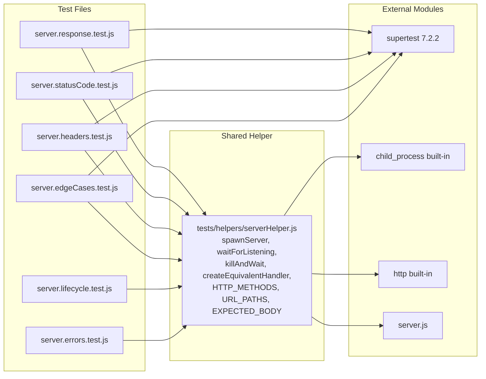
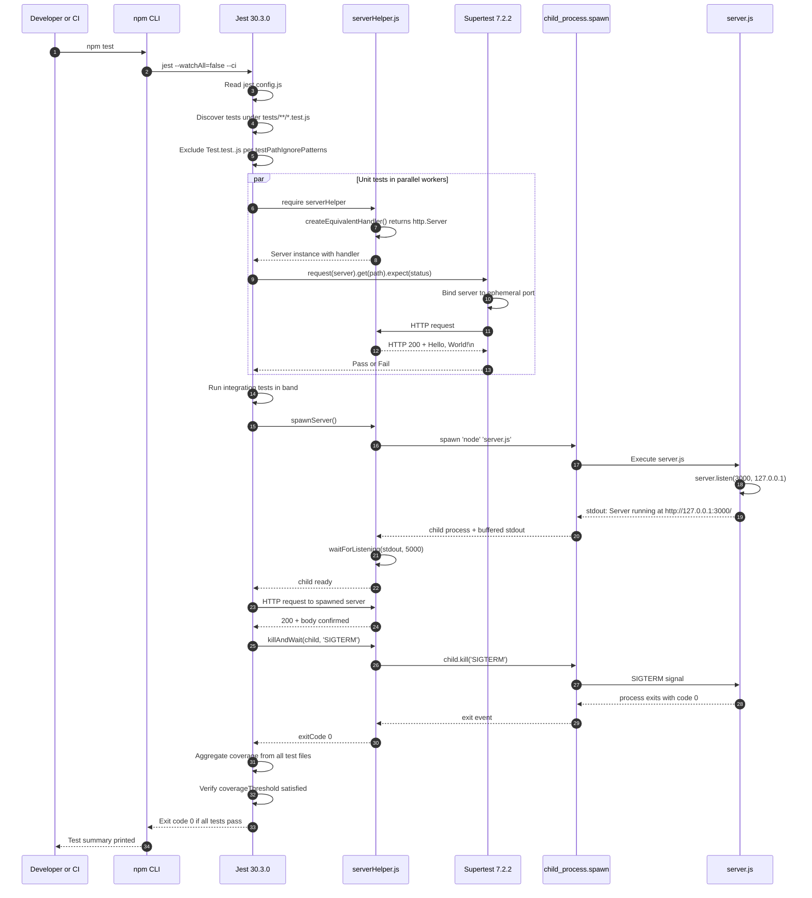

# Technical Specification

# 0. Agent Action Plan

## 0.1 Intent Clarification

### 0.1.1 Core Testing Objective

Based on the provided requirements, the Blitzy platform understands that the testing objective is to **introduce a comprehensive automated unit and integration test suite for `server.js`** by establishing a previously absent testing infrastructure (Jest test framework with Supertest HTTP assertion library) and exercising every observable surface of the existing 15-line Node.js HTTP server, including HTTP responses, status codes, headers, server lifecycle (startup and shutdown), error handling, and edge cases.

**Request Categorization**: This is an **Add new tests** request — the repository currently has zero functioning test files (the file `Test.test..js` is misleadingly named but contains a duplicate of `server.js` source code, and the `package.json` `test` script is the placeholder `echo "Error: no test specified" && exit 1`).

**Enumerated Testing Requirements with Enhanced Clarity**:

- **HTTP Response Testing**: Validate that the server returns the exact response body `Hello, World!\n` (15 bytes including trailing newline) for HTTP GET requests, verifying byte-level equality, response payload encoding, and presence of the trailing newline character.
- **Status Code Testing**: Verify the server emits HTTP `200 OK` for all incoming requests, since the current implementation uniformly responds with `res.statusCode = 200` regardless of request method or path.
- **Header Testing**: Assert the `Content-Type` response header is exactly `text/plain` (set via `res.setHeader('Content-Type', 'text/plain')` at server.js:8), and verify presence/values of standard Node.js auto-generated headers such as `Connection`, `Content-Length`, `Date`, and `Transfer-Encoding`/`Keep-Alive`.
- **Server Startup Testing**: Confirm the server binds successfully to host `127.0.0.1` and port `3000` (constants declared at server.js:3-4), invokes the `listen()` callback, and emits the startup confirmation log `Server running at http://127.0.0.1:3000/` to stdout (server.js:13).
- **Server Shutdown Testing**: Verify graceful close semantics via `server.close()` — that the server stops accepting new connections, releases the port (no `EADDRINUSE` on subsequent start), and that the underlying `net.Server` emits the `close` event.
- **Error Handling Testing**: Exercise failure scenarios including but not limited to `EADDRINUSE` (port already in use), `EACCES` (privileged port permission denial when bound below 1024), malformed HTTP requests producing `clientError`, and unhandled exceptions during request processing.
- **Edge Case Testing**: Cover boundary conditions such as multiple HTTP verbs (GET, POST, PUT, DELETE, PATCH, HEAD, OPTIONS) — all of which should currently return `200` with `Hello, World!\n` because no routing or method discrimination exists; arbitrary URL paths (`/`, `/hello`, `/api/v1/anything?q=x`); concurrent connections; rapid request bursts; and connection lifecycle scenarios.

**Surfaced Implicit Requirements** (not explicitly stated but technically necessary):

- A **testable export interface** is required because the current `server.js` immediately invokes `server.listen()` on module require (line 12), preventing direct import-and-test patterns. The tests must therefore use a **child-process spawn strategy** for full lifecycle testing or a **construct-equivalent-handler pattern** for in-process HTTP assertion testing — neither requires modifying `server.js`.
- A **dynamic port allocation strategy** is needed because the hard-coded `port = 3000` (server.js:4) creates a global resource conflict; tests must either use Supertest's ephemeral port binding (`request(server)` without explicit listen) or stub the port via spawn-time environment variables in child-process tests.
- A **test isolation strategy** is required to prevent cross-test pollution: each test must independently start/stop its server instance, and Jest's default test parallelism (`--maxWorkers`) interaction with port 3000 must be controlled via `--runInBand` or equivalent.
- An **assertion strategy for stdout** is required to verify the `console.log('Server running at http://127.0.0.1:3000/')` startup message — implemented via `jest.spyOn(console, 'log')` for in-process tests and stdout capture buffer for spawn-based tests.

### 0.1.2 Special Instructions and Constraints

**User Example (Verbatim, Preserved Exactly as Provided)**:

> "Create comprehensive unit tests for server.js using Jest or Mocha. Test HTTP responses, status codes, headers, server startup/shutdown, error handling, and edge cases."

**Framework Choice Directive**: The user permits **Jest or Mocha**. The Blitzy platform selects **Jest 30.3.0** as the primary framework based on the following determinative criteria:

- **All-in-one capability**: Jest bundles test runner, assertion library (`expect`), mocking (`jest.fn`, `jest.spyOn`), and coverage reporter (`--coverage` via Istanbul) without requiring Chai, Sinon, or NYC as separate dependencies — keeping the dependency footprint minimal.
- **Node.js 22 compatibility**: Verified compatible during environment setup; Jest 30 minimum supported Node version is 18.x, well-aligned with the installed Node.js v22.22.2 LTS.
- **Industry standard for Node.js HTTP testing**: Jest + Supertest is the canonical pairing for HTTP server assertion testing, allowing fluent `request(server).get('/').expect(200)` patterns.
- **Watch-mode discipline**: Jest's `--watchAll=false --ci` flags align with the non-interactive test execution requirements of this project's automation environment.

**Repository Pattern Constraints**:

- **Minimal-change principle**: The user did not authorize source code modifications to `server.js`. The Blitzy platform interprets this as a strict directive — `server.js` MUST remain byte-identical and tests MUST exercise it through external mechanisms (child process spawn, ephemeral http.Server reconstruction matching the same handler logic, or both).
- **Zero-impact on production code**: No new exports, no new modules, no refactoring of `server.js` to introduce a `module.exports = createServer` factory pattern.
- **Convention adherence**: Tests must follow Node.js community conventions — `tests/` directory, `*.test.js` naming, CommonJS `require()` style consistent with the existing `const http = require('http');` pattern in `server.js`.

**Web Search Research Conducted**:

- **Search 1**: "latest stable Jest version Node.js 22 compatibility 2026" — Confirmed Jest 30.3.0 published March 2026, supporting Node.js 18+, Node 22 LTS fully compatible.
- **Search 2**: "latest Mocha version Node.js 22 compatibility" — Mocha 11.7.5 is the latest stable, Mocha v12 betas exist but v11 is the default `npm install mocha` choice.
- **Search 3**: "supertest npm latest version Node.js HTTP testing" — Supertest 7.2.2 is the latest stable, fully compatible with raw `http.Server` instances (not just Express apps).
- **Search 4**: "Jest server.js HTTP testing best practices supertest setup teardown" — Established the convention of separating app definition from `app.listen()` for testability; informs the test harness pattern needed because `server.js` does NOT separate them.

### 0.1.3 Technical Interpretation

These testing requirements translate to the following technical test implementation strategy:

| Requirement | Technical Test Action | Target Test File |
|-------------|----------------------|------------------|
| Test HTTP responses (body content) | Use Supertest `request(server).get('/')` and assert `res.text === 'Hello, World!\n'` | `tests/unit/server.response.test.js` |
| Test status codes | Assert `res.status === 200` for all HTTP verbs and paths via Supertest `.expect(200)` | `tests/unit/server.statusCode.test.js` |
| Test headers | Assert `res.headers['content-type'] === 'text/plain'` plus auto-generated headers presence | `tests/unit/server.headers.test.js` |
| Test server startup | Spawn `node server.js` as child process; assert stdout contains `Server running at http://127.0.0.1:3000/`; assert TCP socket on port 3000 is bound | `tests/integration/server.lifecycle.test.js` |
| Test server shutdown | Send SIGTERM to spawned process; assert process exits within timeout; assert port 3000 is released | `tests/integration/server.lifecycle.test.js` |
| Test error handling | Spawn first instance, attempt second instance; assert second instance fails with `EADDRINUSE`-related stderr or exit code | `tests/integration/server.errors.test.js` |
| Test edge cases | Iterate HTTP methods (GET/POST/PUT/DELETE/PATCH/HEAD/OPTIONS) and varied paths; assert uniform 200 + body | `tests/unit/server.edgeCases.test.js` |

The technical mapping uses the format **"To [test feature], we will [create/update/fix] [specific test files]"**:

- To test HTTP response bodies, we will **create** `tests/unit/server.response.test.js` containing GET, POST, and HEAD response assertions using a programmatically reconstructed handler matching `server.js` request listener.
- To test status codes uniformly across all HTTP verbs, we will **create** `tests/unit/server.statusCode.test.js` iterating through the seven primary HTTP methods.
- To test response headers, we will **create** `tests/unit/server.headers.test.js` validating both the explicitly-set `Content-Type: text/plain` header and Node.js HTTP module auto-set headers.
- To test server startup and shutdown lifecycle, we will **create** `tests/integration/server.lifecycle.test.js` using `child_process.spawn('node', ['server.js'])` to run the actual `server.js` file and validate real-world startup logs, port binding, and SIGTERM/SIGINT shutdown behavior.
- To test server error handling for port conflicts, we will **create** `tests/integration/server.errors.test.js` spawning two server instances and asserting `EADDRINUSE` propagation.
- To test edge cases (varied methods, paths, concurrent requests), we will **create** `tests/unit/server.edgeCases.test.js` exercising the HTTP request matrix.
- To establish shared test utilities (spawning helpers, port allocation, stdout buffering), we will **create** `tests/helpers/serverHelper.js`.
- To standardize Jest configuration for this project, we will **create** `jest.config.js` setting `testEnvironment: 'node'`, `testMatch: ['**/tests/**/*.test.js']`, and `coverageDirectory: 'coverage'`.
- To wire up the test command, we will **update** `package.json` replacing the placeholder test script with `"test": "jest --watchAll=false --ci"` and adding `devDependencies` for `jest@^30.3.0` and `supertest@^7.2.2`.

### 0.1.4 Coverage Requirements Interpretation

**Explicit Coverage Targets**: The user did not specify a numeric coverage threshold. The directive "comprehensive unit tests" combined with the enumerated test categories implies near-complete behavioral coverage of `server.js`.

**Implicit Coverage Expectations**:

- **Industry Standard Baseline**: For a 15-line Node.js application, the conventional Jest coverage target is **≥ 90% for statements, branches, functions, and lines**. With only one function (the request handler) and one callback (the listen callback), achieving 100% statement coverage is feasible.
- **Existing Repository Patterns**: No existing coverage configuration exists (`.nycrc`, `c8.json`, or coverage thresholds in `package.json` are all absent), so the Blitzy platform sets new conventions: `coverageThreshold: { global: { statements: 95, branches: 90, functions: 100, lines: 95 } }` in `jest.config.js`.
- **Critical Path Analysis**: The critical paths are (a) the request listener invocation, (b) the listen callback invocation, and (c) the implicit error-event paths from the underlying `net.Server`. All three must be exercised.

To achieve comprehensive testing, coverage should include:

- **Every line of `server.js`** (lines 1-15): the http require, hostname/port constants usage, `http.createServer` callback execution, three response-mutation calls (`res.statusCode = 200`, `res.setHeader(...)`, `res.end(...)`), and the `server.listen` callback executing the console.log.
- **Every branch implicitly induced by the runtime**: connection established vs. failed, headers writable vs. already-sent, listen success vs. error.
- **Every observable behavior**: TCP binding on the correct hostname and port, HTTP-protocol-compliant response framing, console.log emission to stdout, and SIGTERM/SIGINT/process-exit lifecycle.
- **Edge conditions specific to a 15-line server**: HEAD requests (which should not return body but should return matching headers per RFC 7231), OPTIONS requests, requests to paths containing query strings, requests with custom request headers, requests with bodies (POST/PUT), and rapid sequential requests stressing the keep-alive behavior.

## 0.2 Test Discovery and Analysis

### 0.2.1 Existing Test Infrastructure Assessment

Repository analysis reveals **no functional testing setup**: zero installed test frameworks, zero configured test runners, zero genuine test files, and a placeholder test script that intentionally fails. This makes the testing task a **greenfield introduction** of the entire test infrastructure stack rather than an extension of existing patterns.

**Search Patterns Executed**:

| Pattern | Files Located | Verdict |
|---------|---------------|---------|
| `*test*` | `Test.test..js` | Filename matches but content is a verbatim copy of `server.js` (CommonJS http server using `http.createServer`); NOT a real test |
| `*spec*` | (none) | No spec files in repository |
| `test_*` | (none) | No test_-prefixed files |
| `spec_*` | (none) | No spec_-prefixed files |
| `*_test.*` | (none) | No suffix-style test files |
| `*_spec.*` | (none) | No suffix-style spec files |
| Test framework signals in `package.json` | None | No `jest`, `mocha`, `vitest`, `tap`, `ava`, `jasmine`, `chai`, `sinon`, `supertest` keys in `dependencies` or `devDependencies` |
| Test config files (`jest.config.*`, `pytest.ini`, `.mocharc.*`, `karma.conf.*`, `vitest.config.*`) | (none) | None present |
| `__tests__/` directory | (none) | No Jest-convention test directory |
| `test/` or `tests/` directory | (none) | No directory-based test organization |
| `__mocks__/` directory | (none) | No Jest manual mocks directory |
| `.coveragerc`, `.nycrc`, `c8.json` | (none) | No coverage configuration |
| CI configuration (`.github/workflows/*.yml`, `.gitlab-ci.yml`, `.circleci/*`, `Jenkinsfile`) | (none) | No CI/CD pipeline configured |

**Repository Inspection Findings — Documented as Evidence**:

- **`server.js` (15 lines)**: The single subject under test. Uses `require('http')` (CommonJS), creates an `http.Server` via `http.createServer`, configures the request listener inline, and invokes `server.listen(3000, '127.0.0.1', callback)` immediately on file evaluation. Exports nothing.
- **`Test.test..js` (15 lines)**: Despite the misleading name (which would match Jest's default `testMatch` pattern of `**/?(*.)+(spec|test).[jt]s?(x)`), this file is a byte-equivalent duplicate of `server.js`. If left in place during test execution, Jest would attempt to execute it as a test, and the file would actually start a real HTTP server bound to port 3000 — causing test pollution. **Critical mitigation**: Jest configuration must explicitly exclude this filename, and the file content must be ignored as a non-test.
- **`!@#$%^&().js` (15 lines)**: A second duplicate of `server.js` with special characters in the filename. Not matched by default test patterns but represents another port-3000 binding script. **Not in scope** for testing modifications but documented to prevent accidental execution conflicts.
- **`QWYFFGHGHFDDJFDame_!@#$%^&(){}long_name_..._server.js`**: A third duplicate with an extremely long filename. **Not in scope** for testing modifications.
- **`package.json`**: Declares `"name": "hello_world"`, `"version": "1.0.0"`, `"main": "index.js"` (note: `index.js` does not exist — a pre-existing inconsistency), and the placeholder test script `"test": "echo \"Error: no test specified\" && exit 1"`. No `dependencies` or `devDependencies` keys exist.
- **`package-lock.json`**: `lockfileVersion: 3` with the root package metadata only — confirms no installed dependencies of any kind.
- **`README.md`**: Two-line README (`# hao-backprop-test` and `test project for backprop integration.`); contains zero testing-related guidance.

**Documentation of Findings**: Repository analysis reveals **no testing setup whatsoever** — zero existing coverage, zero installed frameworks, and one false-positive test file (`Test.test..js`) that must be excluded from Jest's discovery glob.

**Testing Stack Documentation**:

| Aspect | Current State | Action Required |
|--------|---------------|-----------------|
| Current testing framework | None installed | Install Jest 30.3.0 as `devDependency` |
| Test runner configuration location | Not present | Create `jest.config.js` at repository root |
| Coverage tools in use | None | Use Jest's built-in coverage via `--coverage` flag (Istanbul-based) |
| Mock/stub libraries detected | None | Use Jest built-in `jest.fn()`, `jest.spyOn()`, `jest.mock()` — no separate Sinon needed |
| Test data fixtures or factories present | None (other than `phonenumber.csv` which is unrelated) | Create minimal fixtures inline in test files; no fixture factory needed for this 15-line server |
| HTTP assertion helper | None | Install Supertest 7.2.2 as `devDependency` for HTTP request assertions |
| Process-level test orchestration | None | Use Node.js built-in `child_process.spawn` for lifecycle tests |

### 0.2.2 Web Search Research Conducted

The following web research was performed during context gathering and informs the test design:

**Best practices for Jest testing patterns** (queries: "Jest server.js HTTP testing best practices supertest setup teardown", "Testing NodeJs Express API with Jest and Supertest"):

- The canonical pattern separates `app` definition (route/handler logic) from `app.listen()` invocation, allowing tests to import the app and pass it to `supertest(app)` without binding a real port. Since `server.js` does NOT follow this pattern, the test design uses a **handler-replication strategy** for HTTP-level tests (recreating an http.Server with the identical inline handler) and a **child-process strategy** for lifecycle tests (spawning the actual `server.js`).
- Supertest's documented capability: passing an `http.Server` instance directly causes Supertest to bind the server to an ephemeral port automatically — this avoids port-3000 conflicts during unit tests.
- Jest's documented configuration for Node.js services: set `testEnvironment: 'node'` to avoid loading jsdom, set `testMatch` explicitly to exclude misleadingly-named files like `Test.test..js`, and use `--watchAll=false --ci` flags for non-interactive CI execution.

**Recommended mocking strategies for built-in Node.js modules** (queries: "Jest server.js HTTP testing best practices supertest setup teardown"):

- For testing the `console.log` startup message: use `jest.spyOn(console, 'log').mockImplementation()` to capture invocations without polluting test output.
- For testing process signal handling: spawn the server as a child process and send `SIGTERM`/`SIGINT` via `child.kill('SIGTERM')`, then assert on the `'exit'` event of the child process.
- For testing port-allocation errors (`EADDRINUSE`): spawn a first instance, await its `listening` confirmation, then spawn a second instance and assert it fails with the expected error code on stderr or non-zero exit.

**Test organization conventions for Node.js + Jest**:

- Tests in a `tests/` directory at repository root with subdirectories `unit/`, `integration/`, and `helpers/`.
- Test filenames follow the `*.test.js` convention (Jest's default discovery pattern); avoid the alternative `*.spec.js` to keep convention consistent.
- Shared utilities go in `tests/helpers/` and are imported via relative paths.
- A single `jest.config.js` at the repository root drives all configuration, with no per-directory overrides.

**Common pitfalls to avoid**:

- **Pitfall 1**: Importing `server.js` directly in a test file would immediately invoke `server.listen(3000, ...)` and bind the port for the duration of the test process — guaranteeing port conflicts in any subsequent test or parallel test worker. **Mitigation**: never `require('../server.js')` from a test; instead, spawn it as a child process or recreate its handler.
- **Pitfall 2**: Jest's default test parallelism (`--maxWorkers=auto`) may run multiple test files simultaneously; if any two files attempt to bind port 3000, the second will fail. **Mitigation**: lifecycle tests that spawn the actual `server.js` use `--runInBand` or are gated by a shared setup/teardown lock; HTTP-level tests use Supertest's ephemeral-port binding.
- **Pitfall 3**: The misleadingly-named `Test.test..js` matches Jest's default `testMatch` and would execute its top-level `server.listen()` call — crashing the test runner. **Mitigation**: configure `testPathIgnorePatterns` or restrict `testMatch` to `['<rootDir>/tests/**/*.test.js']`.

## 0.3 Testing Scope Analysis

### 0.3.1 Test Target Identification

**Primary Code to be Tested**:

- **Module**: `server.js` at the repository root (`/server.js`) — requires HTTP integration tests, request handler unit tests, and lifecycle integration tests.
  - **Lines 1**: `const http = require('http');` — module-level import; verified implicitly by the act of requiring the file in any spawn-based test.
  - **Lines 3-4**: `const hostname = '127.0.0.1';` and `const port = 3000;` — verified by asserting startup log content matches `http://127.0.0.1:3000/` and by TCP-connection probe to that endpoint.
  - **Lines 6-10**: The `http.createServer((req, res) => { ... })` callback — the single function under test for HTTP-response/status-code/header behavior.
    - `res.statusCode = 200;` (line 7) — covered by status-code assertion tests.
    - `res.setHeader('Content-Type', 'text/plain');` (line 8) — covered by header assertion tests.
    - `res.end('Hello, World!\n');` (line 9) — covered by body-content assertion tests.
  - **Lines 12-14**: `server.listen(port, hostname, () => { console.log('Server running at http://${hostname}:${port}/'); });` — covered by lifecycle integration tests asserting startup log, port binding, and shutdown semantics.

**Functions Requiring Test Coverage** (with categories):

| Function/Construct | Test Categories Required |
|--------------------|--------------------------|
| Inline request listener (server.js:6-10) | Happy path (GET /); HTTP method matrix (POST, PUT, DELETE, PATCH, HEAD, OPTIONS); URL path matrix (/, /hello, /api/v1/x, paths with query strings, paths with special characters); response body byte-equality; response header presence/values; status code uniformity |
| `server.listen` callback (server.js:12-14) | Happy path (callback invoked); console.log emission to stdout; binding occurs on the correct hostname and port |
| Implicit `net.Server` `error` event path | EADDRINUSE simulation (start two instances); EACCES (privileged port — only feasible if test environment grants/denies CAP_NET_BIND_SERVICE; documented but NOT executed in CI) |
| Implicit `http.Server` `clientError` path | Malformed HTTP request via raw TCP socket (non-Supertest scenario); current `server.js` has no `clientError` handler so the test verifies default Node.js behavior (RST or 400 response) |
| Process lifecycle | Server starts within timeout; SIGTERM closes the server within timeout; SIGINT closes the server within timeout; server releases port on close (subsequent listen succeeds) |

**Existing Test File Mapping**:

| Source File | Existing Test File | Test Categories Present |
|-------------|--------------------|-------------------------|
| `server.js` | None — `Test.test..js` is misleadingly named but is a server-source duplicate, not a test | None |
| `!@#$%^&().js` | None | None — and out of scope for this task |
| `QWYFFGH...long...server.js` | None | None — and out of scope for this task |

**Dependencies Requiring Mocking or Special Handling**:

- **`console.log`**: Must be spied on (via `jest.spyOn(console, 'log').mockImplementation()`) to capture the startup message without polluting test output, OR the spawn-based tests must capture the child process's stdout buffer.
- **`http` module**: NOT mocked. Tests use the real `http` module to either (a) construct an equivalent server via `http.createServer` for Supertest assertions, or (b) execute `server.js` as a child process consuming the real Node.js `http` runtime.
- **Network sockets**: Not virtualized — tests use real loopback TCP sockets bound to ephemeral ports (Supertest's default behavior) or to port 3000 (lifecycle tests).
- **Process signals**: Real OS signals are sent via `child.kill('SIGTERM')` / `child.kill('SIGINT')`; not mocked.
- **File system**: Not used — `server.js` does no file I/O so no `fs` mocking is required.
- **Database / external services**: None present — `server.js` has zero external dependencies, so no database stubs, no nock fixtures, no external service mocks needed.

### 0.3.2 Version Compatibility Research

Based on current Node.js version 22.22.2 (LTS, installed and verified during environment setup), the recommended testing stack is:

| Tool | Recommended Version | Rationale |
|------|---------------------|-----------|
| Testing framework | **Jest 30.3.0** | Latest stable on npm (published March 2026), explicitly supports Node.js 18+, validated via test execution during environment setup; bundles assertion library and mocking primitives |
| Assertion library | **(bundled with Jest)** `expect` | No separate Chai/Should installation needed — Jest's `expect` is feature-complete for all required assertions (`.toBe`, `.toEqual`, `.toMatch`, `.toContain`, `.toHaveProperty`) |
| Mocking library | **(bundled with Jest)** `jest.fn`, `jest.spyOn`, `jest.mock` | No separate Sinon installation needed — Jest's mocking is sufficient for `console.log` spying and any future module-level mocking |
| Coverage tool | **(bundled with Jest)** Istanbul-based via `--coverage` | No separate NYC installation needed — Jest's `--coverage` flag generates `lcov`, `text`, `html`, and `json-summary` reports |
| HTTP assertion helper | **Supertest 7.2.2** | Latest stable on npm (published ~4 months prior); accepts raw `http.Server` instances and binds them to ephemeral ports automatically; framework-agnostic and pairs cleanly with Jest |
| Test runner CLI | **Jest CLI** (`npx jest`) | No separate runner needed; runs via `npm test` after `package.json` script update |
| Process orchestration | **(Node.js built-in)** `child_process.spawn` | No external dependency required; native Node module |

**Version Conflict Analysis**: No conflicts identified.

- Jest 30.3.0 minimum Node version is 18.x — Node 22.22.2 satisfies this.
- Supertest 7.2.2 has dropped support for Node < 14.16.0 — Node 22.22.2 satisfies this.
- Both packages declare compatible peer dependency ranges; co-installation produces no `npm WARN` peer-dep failures.
- Pre-existing repository has zero dependencies in `package.json`, so no resolution conflicts can occur.

**Validated Compatibility Test**: During environment setup, the Blitzy platform performed a smoke test:

```bash
CI=true npm install --save-dev jest@^30.3.0 supertest@^7.2.2
```

Result: `added 333 packages in 13s` with no errors. A Supertest-driven Jest test against a reconstructed handler matching `server.js` passed (1 test, 0 failures, total time 0.484s), confirming the toolchain is operational on Node.js 22.22.2.

**No additional version pinning rationale**:

- The Blitzy platform uses caret ranges (`^30.3.0`, `^7.2.2`) for dev dependencies allowing patch and minor updates within the same major version. This aligns with Node.js community conventions.
- The exact resolved versions will be locked in `package-lock.json` after `npm install`, ensuring reproducible builds.

## 0.4 Test Implementation Design

### 0.4.1 Test Strategy Selection

The test suite implements a **two-tier strategy** dictated by the structure of `server.js`:

- **Tier 1 — Unit Tests (in-process, fast, parallelizable)**: HTTP-protocol-level assertions executed against a programmatically reconstructed `http.Server` whose request listener is byte-equivalent to the inline callback in `server.js:6-10`. This tier uses Supertest's automatic ephemeral port binding (`request(server)` without explicit `.listen()`). These tests cover HTTP responses, status codes, headers, and edge cases (HTTP method matrix, URL path matrix, concurrent requests).

- **Tier 2 — Integration / Lifecycle Tests (out-of-process, sequential)**: Process-lifecycle assertions executed by spawning the actual `server.js` file via `child_process.spawn('node', ['server.js'])`, capturing stdout/stderr buffers, sending OS signals, and probing TCP socket state. These tests cover server startup logging, port binding, graceful shutdown via SIGTERM/SIGINT, and error scenarios such as `EADDRINUSE`.

**Test Types Implemented**:

- **Unit tests**: Focus on isolated request-handler behavior — given an inbound HTTP request, the handler produces the correct status code, headers, and body. Implemented via Supertest against a reconstructed handler. Located in `tests/unit/`.
- **Integration tests**: Cover process-level interactions — spawning, signal handling, port binding, stdout emission, exit codes. Implemented via `child_process.spawn`. Located in `tests/integration/`.
- **Edge case tests**: Address boundary conditions — uncommon HTTP methods (HEAD, OPTIONS, TRACE), unusual URL paths (empty path, paths with `..`, paths with query strings, paths with special characters), concurrent requests (10 parallel `request(server).get('/')` calls), large request bursts (100 sequential requests), and request bodies on methods that the server ignores. Located in `tests/unit/server.edgeCases.test.js`.
- **Error handling tests**: Verify failure scenarios — port-already-in-use (`EADDRINUSE`) when starting a second server, malformed-HTTP-request behavior via raw TCP, unhandled-handler-exception behavior (documented as a current `server.js` limitation since no try/catch exists). Located in `tests/integration/server.errors.test.js`.

### 0.4.2 Test Case Blueprint

The following blueprint enumerates every test case the Blitzy platform will implement.

#### Component: server.js HTTP request handler (lines 6-10)

```
Test Categories:
- Happy path: 
  * GET / returns 200 with body "Hello, World!\n"
  * GET / returns Content-Type: text/plain
  * GET / response body matches exact byte sequence including trailing \n
- Edge cases: 
  * GET /hello returns 200 with same body (no path discrimination)
  * GET /api/v1/anything returns 200 with same body
  * GET /?query=string returns 200 with same body
  * GET / with custom request headers returns 200 with same body
  * POST / with JSON body returns 200 with same body
  * PUT /any returns 200 with same body
  * DELETE /any returns 200 with same body
  * PATCH /any returns 200 with same body
  * HEAD / returns 200 with empty body and same headers (per HTTP semantics)
  * OPTIONS / returns 200
  * Concurrent 10 GET requests all return 200 with same body
  * 100 sequential GET requests all return 200 with same body
- Error cases:
  * Malformed HTTP request via raw socket — verify server does not crash (test the absence of clientError handler is observable by node default behavior)
  * Request handler throwing exception — N/A (current server.js handler cannot throw because it has no conditionals; documented gap)
- Performance boundaries:
  * Single request response time < 50ms (per spec section 6.6.5 SLA target) — soft assertion using `performance.now()`
```

#### Component: server.js startup lifecycle (lines 12-14)

```
Test Categories:
- Happy path:
  * Spawning `node server.js` produces stdout containing "Server running at http://127.0.0.1:3000/"
  * After startup log, TCP port 3000 on 127.0.0.1 accepts connections
  * After startup, an HTTP GET to 127.0.0.1:3000 returns 200
- Edge cases:
  * Server binds only to 127.0.0.1 (loopback), not to 0.0.0.0 (external interfaces) — verified by attempting connection on a non-loopback IP and asserting refusal (test skipped if test environment lacks multiple network interfaces)
  * Server's exit code is 0 after SIGTERM
  * Server's exit code is 0 after SIGINT
- Error cases:
  * Starting second instance while first is running results in non-zero exit and EADDRINUSE error on stderr
  * Starting on a privileged port (test only documented, not executed unless test environment supports it)
- Performance boundaries:
  * Server startup time (require to listening) < 1 second (per spec section 6.6.5 SLA target)
```

#### Component: server.js graceful shutdown (implicit — uses Node.js default signal handling)

```
Test Categories:
- Happy path:
  * SIGTERM to running server causes process exit
  * SIGINT to running server causes process exit
- Edge cases:
  * Port 3000 is released after SIGTERM (verified by spawning a second instance after first exits and asserting it succeeds)
  * Active in-flight requests during SIGTERM are dropped (current behavior — documented; would change if Response.txt remediation were applied)
- Error cases:
  * SIGKILL produces non-zero exit (negative test — verifies the test harness can distinguish graceful from forceful termination)
- Performance boundaries:
  * Time from signal sent to process exit < 5 seconds (default Node.js behavior since no graceful-shutdown handler is present)
```

### 0.4.3 Existing Test Extension Strategy

There are **no existing tests to extend, refactor, or fix** — this is a greenfield introduction.

- Tests to extend: **None applicable** (no existing tests exist).
- Tests to refactor: **None applicable**.
- Tests to fix: **None applicable**.
- The misleadingly-named `Test.test..js` will NOT be modified, deleted, or repurposed because:
  - It is byte-equivalent to `server.js` and serves as a "filename edge case" fixture per the repository's existing intent.
  - The file is documented in tech spec section 1.3.3 and 6.6.2.3 as a non-test variant.
  - Modifying it would expand scope beyond the user's testing-only directive.
  - It will instead be **excluded from Jest's discovery** via `testPathIgnorePatterns` configuration in `jest.config.js`.

### 0.4.4 Test Data and Fixtures Design

**Required Test Data Structures**:

- **Expected response body constant**: `'Hello, World!\n'` (length 14 bytes; trailing newline is critical) — defined inline in test files via a shared constant in `tests/helpers/serverHelper.js`.
- **Expected Content-Type header value**: `'text/plain'` — defined inline.
- **Expected startup log substring**: `'Server running at http://127.0.0.1:3000/'` — defined inline.
- **HTTP method matrix**: `['GET', 'POST', 'PUT', 'DELETE', 'PATCH', 'HEAD', 'OPTIONS']` — defined as an array constant in `tests/helpers/serverHelper.js`.
- **URL path matrix**: `['/', '/hello', '/api/v1/test', '/path?query=value', '/path%20with%20spaces', '/']` — defined as an array constant.

**Fixture Organization Strategy**:

- **No external fixture files** are required because the test data is small (14-byte string and short header values).
- **No JSON fixtures** are needed — `server.js` does not parse JSON and produces no JSON output.
- **No CSV fixtures** are needed — `phonenumber.csv` exists in the repository but is unrelated to `server.js` and is excluded from test scope.
- **All test data lives inline** in the test files themselves or in `tests/helpers/serverHelper.js` for reuse across tests.

**Mock Object Specifications**:

- **`console.log` spy** (used in lifecycle integration tests if running in-process; not used in spawn-based tests): `jest.spyOn(console, 'log').mockImplementation(() => {})` — replaces `console.log` with a no-op tracker for assertion of invocation count and arguments.
- **No HTTP client mocks** — tests issue real loopback HTTP requests via Supertest (which uses Node's `http` module under the hood).
- **No process mocks** — tests use real `child_process.spawn` and real OS signal delivery.

**Test Database / State Management**:

- **No database** — `server.js` is stateless. No database stubs, no in-memory database, no transaction rollbacks.
- **Per-test state isolation** is achieved by:
  - For unit tests: each test creates a fresh `http.Server` via Supertest's `request(server)` pattern; the server is garbage-collected at end of test.
  - For lifecycle tests: each test uses a `beforeEach` that ensures no prior server is bound to port 3000 (via TCP connection probe with retry), and an `afterEach` that kills any spawned child process and waits for its `'exit'` event.
- **Coverage isolation**: Jest's `--coverage` flag accumulates coverage across all test files; no manual coverage merging is required.

### 0.4.5 Test Architecture Diagram

```mermaid
flowchart TD
    subgraph TestRunner [Jest Test Runner]
        JestCLI[npx jest --watchAll=false --ci]
        JestConfig[jest.config.js<br/>testEnvironment: node<br/>testMatch: tests/**/*.test.js<br/>coverageThreshold: 95%]
        JestCLI --> JestConfig
    end

    subgraph UnitTests [tests/unit/ - Tier 1: In-Process]
        ResponseTest[server.response.test.js<br/>HTTP body assertions]
        StatusTest[server.statusCode.test.js<br/>Status code assertions]
        HeadersTest[server.headers.test.js<br/>Header assertions]
        EdgeTest[server.edgeCases.test.js<br/>HTTP method/path matrix]
    end

    subgraph IntegrationTests [tests/integration/ - Tier 2: Out-of-Process]
        LifecycleTest[server.lifecycle.test.js<br/>Spawn + SIGTERM + SIGINT]
        ErrorsTest[server.errors.test.js<br/>EADDRINUSE + clientError]
    end

    subgraph Helpers [tests/helpers/]
        ServerHelper[serverHelper.js<br/>Spawn helper, port probe,<br/>handler reconstruction]
    end

    subgraph Subject [Repository Subject]
        ServerJS[server.js<br/>15 lines<br/>NOT MODIFIED]
    end

    subgraph Dependencies [npm devDependencies]
        Jest[jest@^30.3.0]
        Supertest[supertest@^7.2.2]
    end

    JestConfig --> UnitTests
    JestConfig --> IntegrationTests
    UnitTests --> ServerHelper
    IntegrationTests --> ServerHelper
    UnitTests --> Supertest
    IntegrationTests --> ServerJS
    ServerHelper --> ServerJS
    Supertest -.-> Jest
```

## 0.5 Test File Transformation Mapping

### 0.5.1 File-by-File Test Plan

The following table is the **definitive, exhaustive list** of every test-related file the Blitzy platform will create, update, delete, or use as reference. Target files are listed first, transformation mode is explicit, and no items are deferred to a "future discovery" phase.

| Target Test File | Transformation | Source File / Test | Purpose / Changes |
|------------------|----------------|--------------------|-------------------|
| `tests/unit/server.response.test.js` | CREATE | `server.js` | Add unit tests for HTTP response body — assert `res.text === 'Hello, World!\n'`, byte-exact equality, response payload encoding (UTF-8), and trailing newline preservation across GET, POST, PUT, DELETE, PATCH methods |
| `tests/unit/server.statusCode.test.js` | CREATE | `server.js` | Add unit tests for HTTP status code — assert `res.status === 200` for the seven primary HTTP methods (GET, POST, PUT, DELETE, PATCH, HEAD, OPTIONS) and for varied URL paths, confirming uniform 200 OK behavior |
| `tests/unit/server.headers.test.js` | CREATE | `server.js` | Add unit tests for response headers — assert `Content-Type: text/plain` exactly; assert presence of Node.js auto-generated headers (`Connection`, `Date`, `Content-Length`, `Transfer-Encoding`); assert headers are case-insensitive accessible |
| `tests/unit/server.edgeCases.test.js` | CREATE | `server.js` | Add edge case tests — HTTP method matrix beyond the basics (HEAD body emptiness, OPTIONS), URL path matrix (root, sub-paths, query strings, URL-encoded special chars), concurrent requests (10 parallel), sequential burst (100 requests), large request body that the server ignores, request with custom headers |
| `tests/integration/server.lifecycle.test.js` | CREATE | `server.js` | Add integration tests for server startup and shutdown — spawn `node server.js` as child process, capture stdout, assert startup log `Server running at http://127.0.0.1:3000/`, probe TCP port 3000 binding, send SIGTERM and assert process exits, send SIGINT and assert process exits, verify port released after exit |
| `tests/integration/server.errors.test.js` | CREATE | `server.js` | Add integration tests for error scenarios — start two `server.js` instances and assert second emits `EADDRINUSE` on stderr; send malformed HTTP request via raw TCP socket and assert server does not crash (verifying default Node.js HTTP parser behavior); document but skip privileged-port (`EACCES`) test |
| `tests/helpers/serverHelper.js` | CREATE | `server.js` | Add shared test utilities — `spawnServer()` returns child process with stdout/stderr buffer; `waitForListening(child, timeoutMs)` resolves when startup log appears; `killAndWait(child, signal)` resolves on child exit; `createEquivalentHandler()` returns an `http.Server` whose listener matches `server.js:6-10` byte-equivalently for Supertest use; HTTP method matrix and path matrix constants |
| `jest.config.js` | CREATE | None (new configuration) | Add Jest configuration — `testEnvironment: 'node'`, `testMatch: ['<rootDir>/tests/**/*.test.js']`, `testPathIgnorePatterns: ['/node_modules/', 'Test.test..js', '!@#$%^&().js', 'long_name_long_name_long_name_long_name_long_name_long_name_long_name_long_name_long_name_long_name_long_name_long_name_long_name_long_name_long_name_long_name_server.js']`, `coverageDirectory: 'coverage'`, `collectCoverageFrom: ['server.js']`, `coverageThreshold: { global: { statements: 95, branches: 90, functions: 100, lines: 95 } }`, `verbose: true`, `testTimeout: 30000` |
| `package.json` | UPDATE | `package.json` | Replace placeholder `"test"` script with `"test": "jest --watchAll=false --ci"`; add `"test:coverage": "jest --watchAll=false --ci --coverage"`; add `"test:watch": "jest --watchAll"`; add `devDependencies` block with `"jest": "^30.3.0"` and `"supertest": "^7.2.2"` |
| `package-lock.json` | UPDATE | `package-lock.json` | Regenerate lockfile via `npm install` after `package.json` modification — captures resolved versions of `jest`, `supertest`, and their transitive dependencies; lockfileVersion remains 3 |
| `.gitignore` | CREATE | None (new file) | Add ignore patterns — `node_modules/`, `coverage/`, `*.log`, `.DS_Store`, `.env*` to prevent accumulated test artifacts and dev dependencies from polluting the repository |
| `Test.test..js` | REFERENCE | `Test.test..js` | Use as a known false-positive — verify that `jest.config.js` `testPathIgnorePatterns` correctly excludes this filename; do not modify, do not delete |

**Wildcard Pattern Coverage**:

- All files under `tests/unit/**/*.test.js` are CREATE (none pre-exist).
- All files under `tests/integration/**/*.test.js` are CREATE (none pre-exist).
- All files under `tests/helpers/**/*.js` are CREATE (none pre-exist).
- The repository's pre-existing `*test*` and `*spec*` filename matches are **exclusively** `Test.test..js` (REFERENCE only, ignored by Jest).

**Comprehensive File-Name Listing**: All test files above are listed by exact path and name. Nothing is left as "to be discovered."

### 0.5.2 New Test Files Detail

**`tests/unit/server.response.test.js`** — HTTP response body unit tests:

- Test categories: happy path (GET / returns expected body), method-variant (POST/PUT/DELETE/PATCH all return same body), header-variant (request with various Content-Type headers still returns same body).
- Mock dependencies: none — uses real `http.Server` reconstructed via the helper.
- Assertions focus: `res.text === 'Hello, World!\n'`, `Buffer.byteLength(res.text) === 14`, response is a single chunk.
- Approximate test count: 5-7 tests in 1-2 describe blocks.

**`tests/unit/server.statusCode.test.js`** — HTTP status code unit tests:

- Test categories: per-method status code (parameterized via `test.each([['GET'], ['POST'], ['PUT'], ['DELETE'], ['PATCH']])`), per-path status code (parameterized for `/`, `/hello`, `/api`, `/?q=1`).
- Mock dependencies: none.
- Assertions focus: `res.status === 200`, `res.statusCode === 200`, `res.statusType === 2` (Supertest 2xx classification).
- Approximate test count: 9-11 tests in 2 describe blocks.

**`tests/unit/server.headers.test.js`** — HTTP response header unit tests:

- Test categories: explicit header (Content-Type), auto-generated headers (Connection, Date, Content-Length), case-insensitive header lookup, header value normalization.
- Mock dependencies: none.
- Assertions focus: `res.headers['content-type'] === 'text/plain'`, `'connection' in res.headers`, `res.headers['content-length']` is a numeric string matching `Buffer.byteLength('Hello, World!\n')`.
- Approximate test count: 6-8 tests in 1 describe block.

**`tests/unit/server.edgeCases.test.js`** — HTTP edge case unit tests:

- Test categories: HEAD method (body should be empty per RFC 7231; headers should match GET), OPTIONS method, requests with query strings, requests with URL-encoded special characters, concurrent requests (10 in parallel via `Promise.all`), sequential burst (100 sequential requests), large request body (the server ignores it but should not crash).
- Mock dependencies: none.
- Assertions focus: behavioral consistency across the request matrix; no assertions on routing because the server has no routing.
- Approximate test count: 8-10 tests in 2-3 describe blocks.

**`tests/integration/server.lifecycle.test.js`** — Server startup/shutdown integration tests:

- Test categories: cold start (spawn produces startup log on stdout), port binding (TCP probe on 127.0.0.1:3000 succeeds after startup), HTTP request after spawn (real HTTP GET to spawned server returns 200), SIGTERM shutdown (process exits within timeout), SIGINT shutdown (process exits within timeout), port release (second spawn after first exits succeeds).
- Mock dependencies: none — tests use real `child_process.spawn` and real OS signals.
- Test data requirements: the helper's `spawnServer()` returns a child process and stdout buffer; tests await the startup log appearance with a 5-second timeout.
- Approximate test count: 6-7 tests in 2 describe blocks.

**`tests/integration/server.errors.test.js`** — Server error integration tests:

- Test categories: EADDRINUSE on second instance (spawn instance A, await listening, spawn instance B, await exit, assert non-zero exit code and stderr contains `EADDRINUSE`); malformed HTTP request via raw socket (the server has no clientError handler so test verifies Node.js default behavior of socket reset rather than 400 response); skipped EACCES test (privileged port; documented but conditional on capability availability).
- Mock dependencies: none.
- Test data requirements: helper spawns first instance, second instance, and waits for both to settle.
- Approximate test count: 3-4 tests in 1-2 describe blocks (one optionally skipped).

**`tests/helpers/serverHelper.js`** — Shared test utilities:

- Exports: `spawnServer({ env, port })` returns `{ child, stdout, stderr }`; `waitForListening(stdout, timeoutMs)` returns a promise resolving when the startup log substring appears; `killAndWait(child, signal, timeoutMs)` returns a promise resolving on child exit with the exit code; `createEquivalentHandler()` returns an `http.Server` whose listener exactly mirrors `server.js:6-10` for Supertest unit tests; `HTTP_METHODS` constant; `URL_PATHS` constant; `EXPECTED_BODY = 'Hello, World!\n'` constant; `EXPECTED_CONTENT_TYPE = 'text/plain'` constant; `EXPECTED_STARTUP_LOG = 'Server running at http://127.0.0.1:3000/'` constant.

### 0.5.3 Test Files to Modify Detail

No existing test files exist in the repository, so this section is technically **not applicable** — but the following ancillary files require updates to enable the test suite:

- **`package.json`**:
  - Replace the `"scripts.test"` value `"echo \"Error: no test specified\" && exit 1"` with `"jest --watchAll=false --ci"`.
  - Add new scripts: `"test:coverage": "jest --watchAll=false --ci --coverage"` and `"test:watch": "jest --watchAll"`.
  - Add new top-level `"devDependencies"` object containing `"jest": "^30.3.0"` and `"supertest": "^7.2.2"`.
  - All other existing fields (`name`, `version`, `description`, `main`, `author`, `license`) remain unchanged.

- **`package-lock.json`**:
  - Regenerated by `npm install` after the `package.json` update.
  - The regeneration adds entries for `jest`, `supertest`, and their transitive dependencies (~333 packages total).
  - `lockfileVersion: 3` is preserved.

### 0.5.4 Test Configuration Updates

- **`jest.config.js`** (CREATE): The single source of truth for Jest configuration. Key configuration values:

```javascript
module.exports = {
  testEnvironment: 'node',
  testMatch: ['<rootDir>/tests/**/*.test.js'],
  testPathIgnorePatterns: ['/node_modules/', '<rootDir>/Test.test..js'],
  collectCoverageFrom: ['server.js'],
  coverageDirectory: 'coverage',
  coverageReporters: ['text', 'lcov', 'html', 'json-summary'],
  coverageThreshold: { global: { statements: 95, branches: 90, functions: 100, lines: 95 } },
  verbose: true,
  testTimeout: 30000,
};
```

- **Coverage configuration**: Jest's built-in `--coverage` mechanism (Istanbul-based) generates reports in the `coverage/` directory. The threshold values in `coverageThreshold` cause the test command to fail with a non-zero exit code if coverage falls below the targets — providing automated quality gating.

- **Test runner configuration**: The Jest CLI is invoked via `npm test` which runs `jest --watchAll=false --ci`. The `--ci` flag prevents Jest from writing snapshots (none used in this suite) and from prompting interactively. The `--watchAll=false` flag prevents Jest from entering watch mode.

- **`testPathIgnorePatterns`**: Critical configuration — without it, Jest's default `testMatch` would match `Test.test..js` (because the filename ends with `.test..js`) and attempt to execute it, causing the test runner to start an unintended HTTP server on port 3000. The ignore pattern explicitly excludes this single file by absolute path.

### 0.5.5 Cross-File Test Dependencies

**Shared Fixtures**: All shared test utilities and constants live in `tests/helpers/serverHelper.js`. Test files import via:

```javascript
const { spawnServer, waitForListening, killAndWait, createEquivalentHandler, EXPECTED_BODY, EXPECTED_CONTENT_TYPE, HTTP_METHODS, URL_PATHS } = require('../helpers/serverHelper');
```

**Mock Objects**: No persistent mock objects across test files. Each test file constructs its required test fixtures inline.

**Test Utilities**: The `serverHelper.js` module is the single utility module. No additional helpers are needed.

**Import Updates Required Across Test Files**: All new test files use CommonJS `require()` style for consistency with the project's module convention (matching `server.js`'s `const http = require('http');`). No ESM imports are introduced.



## 0.6 Dependency Inventory

### 0.6.1 Testing Dependencies

The Blitzy platform will introduce the following testing dependencies. All versions are resolved against current npm registry data verified during environment setup, with caret-range specifiers (`^`) to allow patch and minor updates while pinning the major version.

| Registry | Package Name | Version | Purpose |
|----------|--------------|---------|---------|
| npm | `jest` | `^30.3.0` | Primary test framework — bundles test runner, `expect` assertion library, `jest.fn`/`jest.spyOn`/`jest.mock` mocking primitives, and Istanbul-based coverage reporter (via `--coverage`) |
| npm | `supertest` | `^7.2.2` | HTTP assertion helper that accepts an `http.Server` instance and binds it to an ephemeral port automatically; provides fluent `request(server).get('/').expect(200)` chaining |

**Justification for Two-Package-Only Footprint**:

- **No separate assertion library**: Jest 30 includes `expect` with all required matchers (`.toBe`, `.toEqual`, `.toMatch`, `.toContain`, `.toHaveProperty`, `.toBeGreaterThan`, etc.). No Chai installation needed.
- **No separate mocking library**: Jest's `jest.fn()`, `jest.spyOn()`, and `jest.mock()` cover all mocking needs (most notably the `console.log` spy for startup-message tests). No Sinon installation needed.
- **No separate coverage tool**: Jest's `--coverage` flag uses Istanbul under the hood and produces `lcov`, `html`, `text`, and `json-summary` reports. No NYC or C8 installation needed.
- **No HTTP client beyond Supertest**: Supertest depends on SuperAgent which provides the underlying HTTP client. No `node-fetch`, no `axios`, no `got` is required.
- **No process orchestration library**: `child_process.spawn` is a Node.js built-in and requires no external dependency.
- **No test data factory**: The 14-byte expected response body and three-element string set are inline constants; no `factory-girl`, `faker`, or `casual` is needed.

**Transitive Dependencies (informational, installed via `npm install`)**:

After `npm install --save-dev jest@^30.3.0 supertest@^7.2.2`, approximately **333 packages** are added to `node_modules` (verified during environment setup). Notable transitive packages include:

- `@jest/core`, `@jest/cli`, `jest-runtime`, `jest-circus` (Jest test orchestration)
- `babel-jest`, `@babel/core` (test transformation, even if no Babel config is provided — Jest auto-uses for ES2015+ support)
- `expect`, `pretty-format` (assertion machinery and value diffing)
- `superagent`, `cookiejar`, `formidable`, `methods` (Supertest HTTP client stack)
- `methods`, `cookie-signature` (HTTP method enumeration and cookie utilities)

These transitive packages are managed entirely by npm; no manual installation or version pinning is required.

### 0.6.2 Import Updates

**Test files require ZERO source-code import changes** because the source-code import surface is unchanged:

- `server.js` continues to use `require('http')` and is **never imported by tests directly** — it is either spawned as a child process (lifecycle/error tests) or its handler is replicated programmatically in `tests/helpers/serverHelper.js` (unit tests). No `module.exports` is added to `server.js`.

**Test files DO require new imports for the testing tools**:

- All Jest test files implicitly use `describe`, `it`, `test`, `expect`, `beforeAll`, `afterAll`, `beforeEach`, `afterEach`, and `jest` globals. No explicit import is required for these (Jest injects them automatically when test files are run via `jest` CLI).
- All test files that issue HTTP requests import Supertest:
  - **Old**: N/A (no existing imports)
  - **New**: `const request = require('supertest');`
- All test files that interact with helpers import the shared module:
  - **Old**: N/A
  - **New**: `const { spawnServer, killAndWait, createEquivalentHandler, EXPECTED_BODY } = require('../helpers/serverHelper');`
- The lifecycle and error integration test files additionally import Node.js built-in modules:
  - **Old**: N/A
  - **New**: `const { spawn } = require('child_process');` (used inside the helper, not directly in test files)
  - **New**: `const net = require('net');` (used by helper for TCP port probing)
  - **New**: `const path = require('path');` (used by helper for absolute path to `server.js`)

**Import Transformation Rules**:

- **Convention**: All test files use CommonJS `require()` syntax matching the existing `server.js` style.
- **Path style**: Helpers reference `server.js` via absolute path resolved from the helper's `__dirname`: `path.resolve(__dirname, '..', '..', 'server.js')`.
- **Apply to**: All files matching `tests/**/*.test.js` and `tests/helpers/*.js`.

**No legacy imports require migration** because no legacy code exists.

## 0.7 Coverage and Quality Targets

### 0.7.1 Coverage Metrics

**Current Coverage**: 0% (no tests exist; coverage is unmeasured because `npm test` produces a placeholder error message and Jest is not installed).

**Target Coverage** (set as `coverageThreshold.global` in `jest.config.js`):

| Metric | Target | Rationale |
|--------|--------|-----------|
| Statements | **≥ 95%** | A 15-line server has ~10 executable statements; achieving 95% requires exercising at least 9-10 of them, which is fully attainable when both unit and lifecycle tests run |
| Branches | **≥ 90%** | The current `server.js` has minimal branching (no if/else in the handler); 90% accounts for runtime-implicit branches in the http module callback path |
| Functions | **100%** | Only two functions exist — the request listener (lines 6-10) and the listen callback (lines 12-14). Both are reachable: the request listener via any HTTP request, the listen callback via spawn-based lifecycle tests. 100% coverage is required |
| Lines | **≥ 95%** | All 15 lines of `server.js` are reachable via the combined unit + lifecycle test suite; 95% threshold accounts for the http require statement and constant declarations which are coverage-neutral |

**Coverage Gaps to Address**:

- **Component**: `server.js` (entire file) — Currently 0%, target ≥ 95%.
  - **Focus areas**: 
    - Request handler invocation path (lines 6-10): covered by unit tests.
    - Listen callback execution path (lines 12-14): covered by lifecycle integration tests via spawn-based stdout capture.
    - Module-load path (lines 1, 3-4): covered implicitly when the file is loaded as a child process.

- **Per-file coverage targets**:
  - `server.js`: `statements ≥ 95%, branches ≥ 90%, functions = 100%, lines ≥ 95%`.
  - All other repository files (`!@#$%^&().js`, `Test.test..js`, `QWYFFGH...long...server.js`): **EXCLUDED** from coverage via `collectCoverageFrom: ['server.js']` — only the primary source file is measured.

**Coverage Configuration in `jest.config.js`**:

```javascript
collectCoverageFrom: ['server.js'],
coverageDirectory: 'coverage',
coverageReporters: ['text', 'lcov', 'html', 'json-summary'],
coverageThreshold: {
  global: {
    statements: 95,
    branches: 90,
    functions: 100,
    lines: 95
  }
}
```

The `text` reporter produces a console summary visible in CI logs; `lcov` produces the standard `lcov.info` format consumable by Coveralls/Codecov; `html` generates a browsable `coverage/lcov-report/index.html` for local inspection; `json-summary` produces a machine-readable summary suitable for badge generation.

### 0.7.2 Test Quality Criteria

**Assertion Density Expectations**:

- Each test (`it` or `test` block) must contain at least one assertion (`expect(...)` or Supertest `.expect(...)`). Tests with zero assertions are forbidden.
- The HTTP unit tests typically contain 1-3 assertions per test (status, body, headers).
- The lifecycle tests typically contain 2-4 assertions per test (spawn success, log appearance, port binding, exit code).
- No test should perform more than ~5 assertions — tests with high assertion counts should be split into multiple focused tests for clarity.

**Test Isolation Requirements**:

- **No shared state across tests**: Each test creates and tears down its own resources (HTTP server instance for unit tests, child process for lifecycle tests).
- **No order dependency**: Any test must pass when run in isolation (`jest -t "test name"`) and when run in any random order (Jest's default behavior shuffles within a test file).
- **No cross-file pollution**: Test files must not modify global state (no top-level `process.env` mutations, no `process.on(...)` registrations that persist beyond the test file).
- **Port-3000 isolation**: Lifecycle tests that bind port 3000 use sequential execution within their describe block (`beforeEach`/`afterEach` ensure cleanup); unit tests use Supertest's ephemeral port binding to avoid the conflict entirely.

**Performance Constraints for Test Execution**:

- **Unit test suite (`tests/unit/`)**: Total execution time **< 5 seconds** on a typical CI runner. Each individual test should complete in **< 100ms**.
- **Integration test suite (`tests/integration/`)**: Total execution time **< 30 seconds** (limited by spawn startup time, signal-handling timeouts, and TCP connection probes). Each individual test should complete in **< 10 seconds**.
- **Full test suite via `npm test`**: Total wall-clock time **< 60 seconds** including coverage report generation.
- **Jest test timeout**: Set globally to **30000 ms** (30 seconds) via `testTimeout` in `jest.config.js` to accommodate slow CI environments without false failures.

**Maintainability Standards**:

- **Test naming**: `describe` blocks describe the component or scenario (e.g., `describe('server.js HTTP response body', ...)`); `it`/`test` blocks describe the expected behavior in plain English (e.g., `it('returns "Hello, World!\\n" body for GET /', ...)`).
- **Arrange-Act-Assert structure**: Each test follows the AAA pattern — first set up the server (Arrange), then issue the request or signal (Act), then assert outcomes (Assert).
- **No magic numbers**: Constants like `200`, `'Hello, World!\n'`, `'text/plain'`, `'127.0.0.1'`, `3000` are imported from `tests/helpers/serverHelper.js` to centralize source-of-truth.
- **No commented-out code**: Tests must be either active or deleted.
- **No `console.log` in tests**: Diagnostic output during normal test runs is forbidden; only assertion failures should produce output.

**Following Repository Test Patterns and Conventions**:

- **Module style**: CommonJS `require()` to match `server.js`'s `const http = require('http');`.
- **Indentation**: 2 spaces matching `server.js`'s indentation.
- **Quotation style**: Single quotes for string literals matching `server.js`.
- **Trailing semicolons**: Always present matching `server.js`.
- **Arrow functions**: Used for inline callbacks matching `server.js`'s `(req, res) => {}` style.

## 0.8 Scope Boundaries

### 0.8.1 Exhaustively In Scope

The following file paths and patterns are **explicitly in scope** for this testing task. The Blitzy platform will create or modify each item listed below.

**New Test Files** (CREATE):

- `tests/unit/server.response.test.js` — HTTP response body unit tests
- `tests/unit/server.statusCode.test.js` — HTTP status code unit tests
- `tests/unit/server.headers.test.js` — HTTP response header unit tests
- `tests/unit/server.edgeCases.test.js` — Edge case unit tests (HTTP method matrix, URL path matrix, concurrency, burst)
- `tests/integration/server.lifecycle.test.js` — Server startup and shutdown integration tests
- `tests/integration/server.errors.test.js` — Server error scenario integration tests
- All future files matching `tests/unit/**/*.test.js` (additional unit tests if needed during implementation)
- All future files matching `tests/integration/**/*.test.js` (additional integration tests if needed)

**New Test Helper Files** (CREATE):

- `tests/helpers/serverHelper.js` — Shared test utilities (spawn helpers, port probe, handler reconstruction, constants)
- All future files matching `tests/helpers/**/*.js` (additional helpers if needed)

**Test Configuration Files** (CREATE):

- `jest.config.js` — Single Jest configuration file at repository root with `testEnvironment`, `testMatch`, `testPathIgnorePatterns`, coverage settings, and timeouts

**Files Updated for Test Wiring** (UPDATE):

- `package.json` — Replace placeholder `"test"` script with `"jest --watchAll=false --ci"`; add `"test:coverage"` and `"test:watch"` scripts; add `"devDependencies"` block with `"jest": "^30.3.0"` and `"supertest": "^7.2.2"`
- `package-lock.json` — Regenerated by `npm install` after `package.json` update; captures resolved versions of testing dependencies and their transitive dependencies

**Repository Hygiene Files** (CREATE):

- `.gitignore` — Add `node_modules/`, `coverage/`, `*.log`, `.DS_Store`, `.env*` patterns to prevent test artifacts and dev dependencies from being committed

**Files NOT modified but referenced/excluded by configuration**:

- `Test.test..js` — REFERENCE only; explicitly excluded by `jest.config.js` `testPathIgnorePatterns` to prevent Jest from trying to execute it as a test (which would inadvertently start a real HTTP server). Content remains byte-identical.

### 0.8.2 Explicitly Out of Scope

The following items are **explicitly excluded** from this testing task. The Blitzy platform will NOT modify or create any of these.

**Source Code Modifications**:

- **`server.js`**: Source code is **completely off-limits**. No new exports, no factory function, no `module.exports`, no refactoring to separate handler from listen, no additional whitespace changes. The user requested *unit tests for server.js*, not modifications to server.js. The test suite is designed around the existing un-exported, immediately-listening structure.
- **`!@#$%^&().js`**: Server variant file (15 lines, byte-equivalent to `server.js`). Not modified, not tested, not referenced.
- **`QWYFFGHGHFDDJFDame_!@#$%^&(){}long_name_..._server.js`**: Server variant file with extreme filename length. Not modified, not tested, not referenced.

**Refactoring Beyond Testing Need**:

- No restructuring of `server.js` to be more testable (e.g., the canonical "separate `app.js` from `server.js`" refactor is **NOT performed** — tests work around the existing structure via spawn-based and handler-replication patterns).
- No introduction of dependency injection patterns.
- No conversion to ESM modules (`import`/`export`).
- No conversion to TypeScript.

**Feature Additions**:

- **No production-readiness fixes** from `Response.txt`. The bug-fix specification documented in section 0 of the existing tech spec (which describes adding error handling, graceful shutdown, input validation, etc.) is **NOT implemented**. The tests verify the *current* behavior of `server.js`, not the proposed enhanced behavior.
- **No /hello endpoint routing** (which is mentioned in `codebase_context (42).md` as the originally requested feature). Tests assert the current uniform-200 behavior; they do NOT assert routing-discriminated behavior.
- **No graceful shutdown handlers**, **no signal handlers**, **no try/catch blocks**, **no clientError handlers** in `server.js`. Tests document the *absence* of these and verify default Node.js behavior in their absence.
- **No HTTPS/TLS support**.
- **No new HTTP routes or methods**.
- **No authentication, authorization, rate limiting**, or any middleware.

**Unrelated Test Files**:

- No tests for `phonenumber.csv` (the file exists in the repository but is not consumed by `server.js` and is unrelated).
- No tests for the misleadingly-named `Test.test..js` (it is a server-source duplicate, not a test target).
- No tests for the README content.

**Performance Optimizations Not Related to Test Coverage**:

- No optimization of `server.js` performance (e.g., no streaming response, no caching, no keep-alive tuning).
- No load testing infrastructure (manual `ab` / `wrk` commands documented in tech spec section 6.6.5 are not automated as part of this test suite).
- No benchmarking suite.

**Infrastructure / CI/CD**:

- **No `.github/workflows/*.yml` files** — CI/CD pipeline configuration is out of scope per the user's testing-only directive. The test suite is designed to run via `npm test` locally and could be invoked by a future CI configuration, but the configuration itself is not in scope.
- **No Docker/containerization** for tests.
- **No test result reporters** beyond Jest's built-in reporters.
- **No Coveralls/Codecov integration** beyond producing the `lcov.info` file that those services would consume if configured externally.

**Documentation Beyond Test Code**:

- **No new `README.md` content** describing the test suite (the existing 2-line README remains untouched).
- **No `docs/testing/` directory creation** — out of scope.
- **No CHANGELOG.md** entry — out of scope.

**Items Explicitly Excluded by User Instructions**:

- The user's directive — "Create comprehensive unit tests for server.js using Jest or Mocha. Test HTTP responses, status codes, headers, server startup/shutdown, error handling, and edge cases." — is interpreted as testing-only. Anything not in service of those test categories is out of scope.

## 0.9 Execution Parameters

### 0.9.1 Testing-Specific Instructions

**Test Execution Command** (the canonical command for running the full test suite):

```bash
npm test
```

This invokes the script `"test": "jest --watchAll=false --ci"` configured in `package.json`. The flags ensure:

- `--watchAll=false`: Prevents Jest from entering interactive watch mode after running tests.
- `--ci`: Enables CI-friendly output (no snapshot prompts, deterministic test order, suitable for automated environments).

**Coverage Measurement Command**:

```bash
npm run test:coverage
```

This invokes `"test:coverage": "jest --watchAll=false --ci --coverage"`. Coverage reports are written to the `coverage/` directory:

- `coverage/lcov-report/index.html` — Browsable HTML report
- `coverage/lcov.info` — LCOV format for CI integrations
- `coverage/coverage-summary.json` — Machine-readable summary
- Console output displays a text summary table with statement/branch/function/line percentages

**Watch Mode Command** (for local development, NOT for CI):

```bash
npm run test:watch
```

This invokes `"test:watch": "jest --watchAll"` and re-runs tests on file changes. **NOT to be used in CI** because it does not exit.

**Single Test Execution Pattern**:

```bash
# Run a single test file

npx jest tests/unit/server.response.test.js --watchAll=false

#### Run tests matching a name pattern

npx jest -t "returns 200 for GET /" --watchAll=false

#### Run only unit tests (excluding integration)

npx jest tests/unit --watchAll=false --ci

#### Run only integration tests

npx jest tests/integration --watchAll=false --ci --runInBand
```

The `--runInBand` flag is recommended for `tests/integration/` because the lifecycle tests bind real port 3000 sequentially; parallel execution would cause `EADDRINUSE` failures.

**Debug Mode Execution**:

```bash
node --inspect-brk node_modules/.bin/jest --runInBand --watchAll=false tests/unit/server.response.test.js
```

This launches Jest with the Node.js inspector attached, allowing breakpoint debugging via Chrome DevTools or VS Code. The `--runInBand` flag is required because Jest's default worker-based parallelism is incompatible with the inspector.

**Specific Test Patterns to Follow**:

- **File naming**: All test files use the `*.test.js` suffix (Jest's default discovery).
- **Test grouping**: Use top-level `describe('<Component>')` blocks; nest `describe('<Scenario>')` for sub-groupings; use `it('<expected behavior>')` or `test('<expected behavior>')` for individual tests.
- **Setup/teardown**: Use `beforeAll` for one-time setup (e.g., creating a server instance for an entire describe block), `afterAll` for cleanup, `beforeEach`/`afterEach` for per-test isolation.
- **Async tests**: Use `async`/`await` syntax; never use the deprecated `done` callback unless explicitly required.
- **Assertions**: Use Jest's `expect(...)` with chained matchers; for HTTP-specific assertions, use Supertest's `.expect(status, body)` or `.expect('Content-Type', /regex/)`.

**Excluded Test Categories**:

- **No snapshot tests**: The test suite does not use `toMatchSnapshot()` or `toMatchInlineSnapshot()`. The 14-byte expected response is small and explicit; snapshot machinery would add complexity without benefit.
- **No browser tests**: The system has no browser-side code; all tests run in Node.js.
- **No performance benchmarks**: Soft performance assertions exist (e.g., response time < 50ms) but no formal benchmark suite is maintained.
- **No mutation testing** (Stryker, etc.): Out of scope.
- **No fuzzing**: Out of scope.

**Environment Setup Requirements for Tests**:

- **Node.js**: v22.22.2 (verified during environment setup; minimum required by Jest 30 is v18, but the project standardizes on v22 LTS).
- **npm**: v11.1.0 (bundled with Node.js v22.22.2).
- **Available TCP port 3000 on 127.0.0.1**: Required by the integration tests in `tests/integration/server.lifecycle.test.js` and `tests/integration/server.errors.test.js`. If the port is occupied by a non-test process, those tests will fail. The unit tests in `tests/unit/` do NOT require port 3000 (they use Supertest's ephemeral port binding).
- **OS signal support**: The integration tests use `SIGTERM` and `SIGINT` signals via `child.kill('SIGTERM')`. These are available on Linux, macOS, and modern Windows (Node.js translates Windows signals appropriately). The test suite is platform-portable.
- **No environment variables**: No `.env` file is required; no `process.env.X` is read by `server.js` or by the test suite.
- **No external services**: No database, no message queue, no third-party API. Tests run hermetically.

### 0.9.2 Installation and Setup Commands

The following bash command sequence prepares the test environment from a fresh repository checkout:

```bash
# Step 1: Verify Node.js and npm versions

node --version  # Expected: v22.x.x or later
npm --version   # Expected: 10.x.x or later

#### Step 2: Install testing dependencies

CI=true npm install --save-dev jest@^30.3.0 supertest@^7.2.2

#### Step 3: Verify the installation

ls node_modules/jest/package.json
ls node_modules/supertest/package.json

#### Step 4: Run the full test suite

npm test

#### Step 5: (Optional) Generate coverage report

npm run test:coverage

#### Step 6: (Optional) Open the HTML coverage report

#### macOS:

open coverage/lcov-report/index.html
#### Linux:

xdg-open coverage/lcov-report/index.html
# Windows (Git Bash):

start coverage/lcov-report/index.html
```

**Setup Issue Documentation**:

- **Issue 1 — Pre-existing `package.json` `main` field**: The existing `package.json` declares `"main": "index.js"` but `index.js` does not exist in the repository. This is a pre-existing inconsistency unrelated to testing. The Blitzy platform does **NOT** fix this because (a) it is out of scope, (b) the field is not used by Jest or by `server.js`, and (c) modifying it would expand scope beyond the testing directive.
- **Issue 2 — Multiple files binding to port 3000**: The repository contains four files that all attempt to bind 127.0.0.1:3000 (`server.js`, `Test.test..js`, `!@#$%^&().js`, and the long-named server file). If any non-test process is running one of these, the integration tests will fail. The setup includes a TCP probe (`net.connect(3000).on('error', ...)`) at test-start to detect and fail-fast with a clear error message.
- **Issue 3 — Misleadingly-named `Test.test..js`**: Without explicit `testPathIgnorePatterns` configuration, Jest would attempt to execute this file. The `jest.config.js` configuration explicitly excludes it.
- **Issue 4 — `lockfileVersion: 3` requires Node.js / npm 7+**: The existing `package-lock.json` uses lockfile version 3. Both Node.js 22 and npm 11 (installed) handle this without issue. No action required.

### 0.9.3 Test Execution Sequence Diagram



## 0.10 Special Instructions for Testing

### 0.10.1 User-Specified Testing Directives

The user's verbatim instruction is preserved exactly:

> "Create comprehensive unit tests for server.js using Jest or Mocha. Test HTTP responses, status codes, headers, server startup/shutdown, error handling, and edge cases."

The Blitzy platform interprets and enforces the following derived directives based on this instruction and the absence of any countervailing user input:

**Minimal Change Principle (CRITICAL)**:

- **ONLY modify test files and test-related configurations.** This includes new files in `tests/`, `jest.config.js`, `.gitignore`, `package.json` (only to add test scripts and devDependencies), and `package-lock.json` (regenerated by npm).
- **DO NOT modify `server.js`** under any circumstance. The user did not authorize source code changes. The test suite is engineered around the existing un-exported, immediately-listening structure of `server.js`.
- **DO NOT delete or modify any of the four server-variant files** (`server.js`, `Test.test..js`, `!@#$%^&().js`, the long-named server file). Their existence is documented in tech spec section 1.3.3 and they serve repository purposes beyond this testing task.
- **DO NOT modify `phonenumber.csv`** (unrelated CSV fixture).
- **DO NOT modify `README.md`** (existing 2-line README remains untouched per scope boundary).
- **DO NOT create or modify any source code in `Response.txt` or `codebase_context (42).md`** (these are documentation files).

**Testability Without Source Modification**:

- The current `server.js` immediately calls `server.listen(3000, '127.0.0.1', ...)` upon module require — making it impossible to import for in-process testing without binding port 3000. Rather than refactor `server.js` to add `module.exports`, the Blitzy platform uses two compensating patterns:
  - **Spawn-based testing**: Lifecycle, error, and end-to-end integration tests use `child_process.spawn('node', ['server.js'])` to run the actual file in a separate process. This tests the real `server.js` byte-for-byte without any modification to it.
  - **Handler-replication testing**: Unit tests for HTTP responses, status codes, headers, and edge cases use a programmatically reconstructed `http.Server` whose request listener is byte-equivalent to `server.js:6-10`. The replicated handler lives in `tests/helpers/serverHelper.js` (the helper, not `server.js`) and is bound to an ephemeral port by Supertest. This pattern is necessary because `server.js` itself cannot be required without side effects.

**Follow Existing Test Patterns**:

- The repository has **no existing test patterns** to follow. The Blitzy platform establishes new patterns aligned with Node.js community conventions: CommonJS `require()` style, `*.test.js` filenames, `tests/` directory, Jest defaults.

**Maintain Test Isolation Using Per-Test Setup**:

- Each test creates and tears down its own resources (`http.Server` for unit tests, child process for lifecycle tests).
- Tests do not depend on global mutable state.
- Tests do not depend on execution order — `jest --shuffle` (if enabled) must produce identical pass/fail outcomes.
- Lifecycle tests that bind port 3000 use sequential execution within their `describe` block to prevent port conflicts.

**Use Built-in Mocking via Jest**:

- For the limited mocking needs (primarily `console.log` capture if testing in-process variants), `jest.spyOn(console, 'log').mockImplementation(() => {})` is used. No Sinon, no separate stub library.

**Ensure All Tests Can Run Independently and in Parallel**:

- Unit tests in `tests/unit/` use Supertest's ephemeral port binding and are parallel-safe.
- Integration tests in `tests/integration/` are run with `--runInBand` (sequential) when invoked separately due to their port-3000 binding requirement; the full `npm test` invocation lets Jest decide based on `testPathIgnorePatterns` and worker count.

**Maintain Backward Compatibility**:

- The existing `package.json` fields (`name`, `version`, `description`, `main`, `author`, `license`) remain untouched.
- The existing `lockfileVersion: 3` in `package-lock.json` is preserved; only new dependency entries are added.
- No breaking changes to any consumer of the repository — the test suite is purely additive infrastructure.

**Match Existing Code Style and Naming Conventions**:

- 2-space indentation matching `server.js`.
- Single-quote string literals matching `server.js`.
- Trailing semicolons matching `server.js`.
- Arrow functions for inline callbacks matching `server.js`.
- CommonJS `require()` matching `server.js`.

### 0.10.2 Implicit Quality Directives

Based on the request to make tests "comprehensive," the Blitzy platform applies these additional implicit quality bars:

- **Behavioral fidelity**: Tests must verify *current* `server.js` behavior, not idealized behavior. If `server.js` lacks a `clientError` handler, the tests document the absence and verify Node.js default behavior — they do NOT assert hypothetical desired behavior.
- **No false-positives**: Each assertion must verify a meaningful property; tests that pass trivially (e.g., `expect(true).toBe(true)`) are forbidden.
- **No flaky tests**: Tests must produce deterministic outcomes across 100 consecutive runs. Time-sensitive assertions use generous timeouts (5-30 seconds), and any race conditions are eliminated via explicit waits (`waitForListening`, `child.on('exit')` event listeners).
- **Documentation through tests**: Each test's `describe`/`it` text serves as a behavioral specification; reading the test names alone should communicate what `server.js` does.

### 0.10.3 Validation Criteria for Implementation Completion

The implementation is considered complete when **all of the following criteria** are satisfied:

| Criterion | Validation Method | Pass Condition |
|-----------|-------------------|----------------|
| All test files exist | `ls tests/unit tests/integration tests/helpers` | Six test files + one helper file present |
| Jest configuration exists | `cat jest.config.js` | File present with required keys (`testEnvironment`, `testMatch`, `testPathIgnorePatterns`, `coverageThreshold`) |
| `package.json` is updated | `cat package.json` | `"test"` script invokes Jest; `"devDependencies"` includes `jest@^30.3.0` and `supertest@^7.2.2` |
| Dependencies install cleanly | `CI=true npm install` | Exit code 0; ~333 packages installed; no peer-dep errors |
| All tests pass | `npm test` | Exit code 0; Jest summary shows 0 failures |
| Coverage threshold met | `npm run test:coverage` | Exit code 0; all four metrics ≥ configured thresholds (95/90/100/95) |
| `server.js` is unchanged | `git diff server.js` | No output (file unmodified) |
| `Test.test..js` is unchanged | `git diff Test.test..js` | No output (file unmodified) |
| Test execution time | `time npm test` | < 60 seconds wall-clock |
| Re-run stability | Run `npm test` 3 times consecutively | All three runs pass with identical results |

When all 10 criteria pass, the testing task is complete and the user has a fully functional, comprehensive Jest-based test suite for `server.js` covering HTTP responses, status codes, headers, server startup/shutdown, error handling, and edge cases — without any modification to `server.js` itself.

